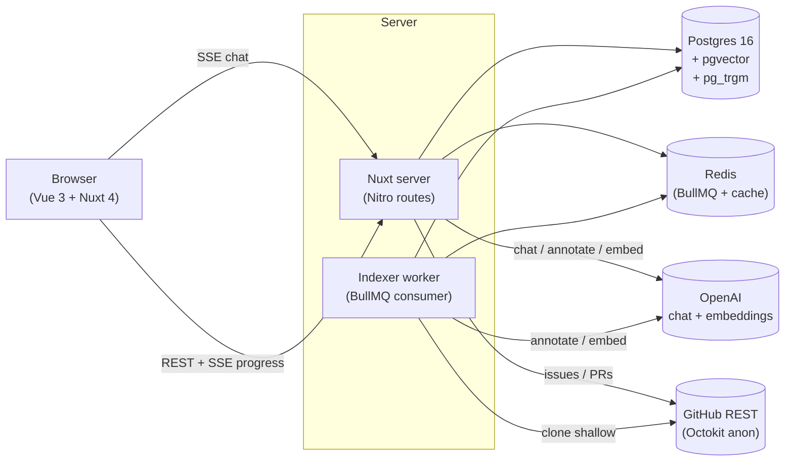

<div align="center">

# RepoBuddy

**Your first PR to any open-source repo. Faster.**

RepoBuddy indexes a public Git repository into a knowledge graph and lets you ask anything about it — what runs, what matters, where a safe first contribution could land — with answers grounded in the actual code.

<p>
  <a href="#live-demo">Live demo</a> ·
  <a href="#what-it-does">What it does</a> ·
  <a href="#run-locally">Run locally</a> ·
  <a href="docs/architecture.md">Architecture</a> ·
  <a href="docs/kag-planning.md">KAG planning</a> ·
  <a href="docs/indexing-pipeline.md">Indexing pipeline</a> ·
  <a href="docs/frontend.md">Frontend</a>
</p>

<p><a href="README.ru.md">🇷🇺 Read in Russian / Читать по-русски</a></p>

</div>

---

## Live demo

<!-- TODO: replace with hosted URL once deployed -->
**Hosted instance**: _coming soon_ — see [Run locally](#run-locally) for now.

Pre-indexed demo workspaces (open without an account):

| Repo | Why it's interesting |
| --- | --- |
| `developit/mitt` | Tiny (~30 lines core) — good for seeing how granularly entities + chunks decompose. |
| `sindresorhus/p-limit` | One-function library with deep type magic. |
| `colinhacks/zod` | Mid-sized TypeScript codebase with rich type relations. |

## What it does

Paste a public GitHub URL → RepoBuddy clones the repo, extracts AST entities + relations across TypeScript, JavaScript, Python and Go, builds a typed knowledge graph in Postgres + pgvector, and exposes:

- **Contributor's tour** — entry points, the classes and functions everything depends on, hot files, safe first-PR zones derived from the graph (hasTests × stability × small file), the project's `CONTRIBUTING.md` / PR template / `CODE_OF_CONDUCT.md`, an auto-generated architecture diagram, and a setup-guide extracted from the manifests + README.
- **Chat with cited answers** — a multi-step planner picks operators over the graph (`find_symbol → get_callers → retrieve_code_chunks → answer`), runs them deterministically, and streams a final answer where every claim links to the chunk or entity it came from.
- **Auto-explore (agentic) mode** — the LLM gets the operator catalogue as function-calling tools and loops on its own until it can answer. More expensive per turn, more thorough for exploratory questions.
- **GitHub issues + PRs as first-class** — the chat can pull open issues, link them to the code they mention, find similar past issues by embedding cosine, and surface merged PRs that fixed them.
- **Walkthrough as a Mermaid sequence diagram** — ask "how does X work" and get the actual call chain rendered inline.
- **Treemap explore** — every file sized by LOC and tinted by hotness / coverage. Click a tile → its neighbour graph.
- **Reasoning Inspector** — every assistant turn carries its plan + trace; the inspector renders the plan as an SVG flowchart (or, in agentic mode, a timeline of tool dispatches grouped by iteration).

## Architecture at a glance



Full breakdown: [`docs/architecture.md`](docs/architecture.md).

## How it differs from "chat with your code"

Most code-RAG tools follow `question → embed → similar-chunks → LLM`. That fails for graph questions ("who calls X transitively?"), enumeration ("list all routes"), and anything anchored on a specific issue / PR / commit.

RepoBuddy builds a typed graph first and exposes 20+ operators the planner picks from — graph traversal (`get_callers` is a recursive CTE over `relations`, not a similarity search), hybrid retrieval (vector + BM25 combined via RRF), external GitHub queries (issues, PRs, cross-issue similarity), and a single `read_file` verb for verbatim file content.

Every plan and its trace are persisted with the assistant message, so reopening a chat from a share link shows not just the answer but the reasoning that produced it.

Detailed walkthrough: [`docs/kag-planning.md`](docs/kag-planning.md).

## Tech stack

**Frontend** — Nuxt 4, Vue 3 Composition API, Tailwind 4, shadcn-vue, `marked` + `isomorphic-dompurify` for chat-message rendering, `shiki` for syntax highlighting (lazy-loaded, dual-theme via CSS variables), `mermaid` for diagrams (lazy-loaded), `d3-hierarchy` for treemap, `sigma` + `graphology` for the neighbour graph, `@nuxtjs/i18n` (cookie-driven, no URL prefix), `@nuxtjs/color-mode`.

**Backend** — Nitro routes, BullMQ workers, `drizzle-orm` (Postgres + pgvector via `customType`), `nuxt-auth-utils` (GitHub OAuth, AES-GCM encrypted refresh tokens), Pino structured logging, `prom-client` metrics, `@octokit/rest`.

**AI** — OpenAI `gpt-4o` (planning, annotation, answer) + `text-embedding-3-small` (1536-dim embeddings). Pluggable provider — BYOK supported (per-user encrypted API key + base URL). Hybrid search = vector cosine + Postgres `ts_rank` combined via reciprocal-rank-fusion.

**Code parsing** — `ts-morph` (TypeScript, JavaScript, Vue SFC), `web-tree-sitter` (Python, Go) with WASM grammars.

**DevOps** — Docker Compose dev stack (Postgres, Redis, Grafana + Loki + Prometheus + Promtail), production compose with Caddy auto-SSL, `pg_dump` backup script.

## Run locally

```bash
# 1. Clone + install
git clone <this-repo> repobuddy && cd repobuddy
pnpm install

# 2. Bring up Postgres + Redis (Docker)
cp .env.example .env   # then fill OPENAI_API_KEY + GITHUB_CLIENT_ID/SECRET
pnpm db:up
pnpm db:migrate

# 3. Run web + worker (two terminals)
pnpm dev:web
pnpm dev:worker

# 4. Open http://localhost:3000
```

Optional dashboards: `docker compose up -d grafana prometheus loki promtail` → Grafana at `http://localhost:3301` (`admin` / `admin`).

## Tests

```bash
pnpm typecheck   # nuxt typecheck across server + app
pnpm test        # vitest — unit + integration
pnpm test:watch
```

Integration tests share a single Postgres instance — the suite runs sequentially (`fileParallelism: false`) to avoid TRUNCATE races. Unit tests cover the indexer parsers (TS/JS/Py/Go), the KAG executor, the planner schema, and key Vue composables.

## Status & limitations

- AST coverage is intentionally incomplete — re-exports, generic resolution, dynamic imports are best-effort.
- LLM annotation costs real money (~$0.50–$2.00 per medium repo). Hard guardrail via `LLM_BUDGET_USD_PER_INDEX`.
- The agentic chat mode (`Auto-explore` checkbox) is opt-in because each turn can cost 4–8× a planned-mode answer.
- Mobile experience: chat works end-to-end; side panels (Reasoning Inspector / Source Viewer / Neighbour Graph) require ≥`lg` viewport — a bottom-sheet variant is in progress.

## License

MIT.
