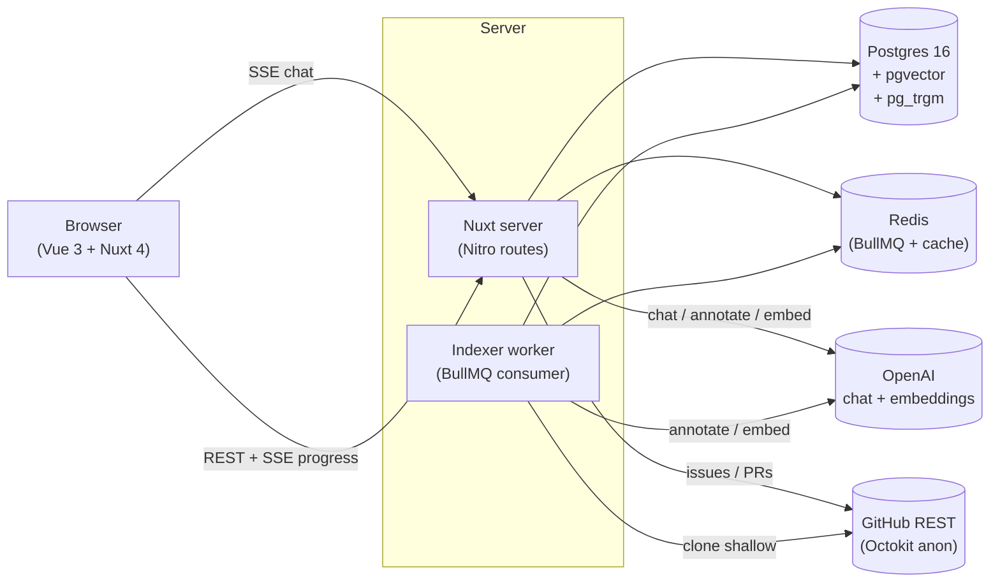

<div align="center">

# RepoBuddy

**Твой первый PR в любой open-source проект. Быстрее.**

RepoBuddy индексирует публичный Git-репозиторий в граф знаний и даёт спрашивать про него что угодно — что запускается, что важно, где можно сделать первый PR безопасно — с ответами, опирающимися на реальный код.

<p>
  <a href="#демо">Демо</a> ·
  <a href="#что-делает">Что делает</a> ·
  <a href="#запуск-локально">Запуск локально</a> ·
  <a href="docs/architecture.md">Архитектура</a> ·
  <a href="docs/kag-planning.md">KAG-планирование</a> ·
  <a href="docs/indexing-pipeline.md">Конвейер индексации</a> ·
  <a href="docs/frontend.md">Frontend</a>
</p>

<p><a href="README.md">🇬🇧 Read in English</a></p>

</div>

---

## Демо

<!-- TODO: ссылка на хостинг после деплоя -->
**Хостинг**: _скоро_ — пока что см. [Запуск локально](#запуск-локально).

Предварительно проиндексированные демо-воркспейсы (открываются без аккаунта):

| Репо | Чем интересен |
| --- | --- |
| `developit/mitt` | Крошечный (~30 строк core) — наглядно видно как сущности и chunks раскладываются. |
| `sindresorhus/p-limit` | Одна функция, нетривиальная типизация. |
| `colinhacks/zod` | Средний TypeScript-кодбейс с богатыми type-отношениями. |

## Что делает

Вставляешь URL публичного GitHub-репо → RepoBuddy клонирует, извлекает AST-сущности и связи через TypeScript / JavaScript / Python / Go, строит типизированный граф знаний в Postgres + pgvector и даёт:

- **Тур контрибьютора** — точки входа, классы и функции на которые опирается остальной код, «горячие» файлы, безопасные зоны для первого PR (тесты × стабильность × маленький файл), `CONTRIBUTING.md` / PR-шаблон / `CODE_OF_CONDUCT.md` проекта, auto-generated архитектурная диаграмма и setup-guide из манифестов + README.
- **Чат с цитированием** — multi-step планировщик подбирает операторы поверх графа (`find_symbol → get_callers → retrieve_code_chunks → answer`), детерминированно их выполняет и стримит финальный ответ где каждое утверждение ссылается на фрагмент или сущность из которой оно взято.
- **Auto-explore (agentic) режим** — LLM получает каталог операторов как function-calling tools и сам зацикливается пока не сможет ответить. Дороже на запрос, но глубже на exploratory-вопросах.
- **GitHub issues + PRs как first-class** — чат тянет открытые issues, связывает их с упомянутым кодом, ищет похожие прошлые issues через embedding cosine, и поднимает смерженные PRs которые их зафиксили.
- **Walkthrough как Mermaid sequence-диаграмма** — спрашиваешь «как работает X» и получаешь реальную call-chain inline.
- **Treemap-обзор** — каждый файл размером по LOC и оттенком по hotness / coverage. Клик по плитке → граф соседей.
- **Reasoning Inspector** — каждый assistant-turn несёт свой plan + trace; inspector рисует план как SVG-flowchart (или, в agentic-режиме, timeline tool-вызовов сгруппированных по итерациям).

## Архитектура



Подробный разбор: [`docs/architecture.md`](docs/architecture.md).

## Чем отличается от «chat with your code»

Большинство code-RAG инструментов работают как `вопрос → embedding → похожие chunks → LLM`. Это падает на graph-вопросах («кто транзитивно вызывает X?»), перечислениях («перечисли все routes»), и на любых вопросах привязанных к конкретному issue / PR / коммиту.

RepoBuddy сначала строит типизированный граф и выставляет 20+ операторов из которых планировщик выбирает — graph traversal (`get_callers` это рекурсивный CTE по `relations`, не similarity-поиск), hybrid retrieval (vector + BM25 объединённые через RRF), внешние GitHub-запросы (issues, PRs, similarity между issues), и отдельный `read_file` для дословного содержимого файла.

Каждый план и его trace сохраняются вместе с assistant-сообщением, поэтому при повторном открытии чата по share-ссылке виден не только ответ, но и рассуждение которое его произвело.

Полный walkthrough: [`docs/kag-planning.md`](docs/kag-planning.md).

## Стек

**Frontend** — Nuxt 4, Vue 3 Composition API, Tailwind 4, shadcn-vue, `marked` + `isomorphic-dompurify` для рендера чат-сообщений, `shiki` для подсветки синтаксиса (lazy-loaded, dual-theme через CSS-переменные), `mermaid` для диаграмм (lazy-loaded), `d3-hierarchy` для treemap, `sigma` + `graphology` для neighbour-графа, `@nuxtjs/i18n` (cookie-driven, без URL-префиксов), `@nuxtjs/color-mode`.

**Backend** — Nitro routes, BullMQ workers, `drizzle-orm` (Postgres + pgvector через `customType`), `nuxt-auth-utils` (GitHub OAuth, AES-GCM зашифрованные refresh-токены), Pino structured logging, `prom-client` metrics, `@octokit/rest`.

**AI** — OpenAI `gpt-4o` (планирование, аннотация, ответ) + `text-embedding-3-small` (1536-dim embeddings). Pluggable провайдер — поддерживается BYOK (на юзера: зашифрованный API-key + base URL). Hybrid search = vector cosine + Postgres `ts_rank` через reciprocal-rank-fusion.

**Парсинг кода** — `ts-morph` (TypeScript, JavaScript, Vue SFC), `web-tree-sitter` (Python, Go) с WASM-грамматиками.

**DevOps** — Docker Compose dev-стек (Postgres, Redis, Grafana + Loki + Prometheus + Promtail), production-compose с Caddy auto-SSL, `pg_dump` backup-скрипт.

## Запуск локально

```bash
# 1. Клонируем + ставим зависимости
git clone <this-repo> repobuddy && cd repobuddy
pnpm install

# 2. Поднимаем Postgres + Redis (Docker)
cp .env.example .env   # затем заполни OPENAI_API_KEY + GITHUB_CLIENT_ID/SECRET
pnpm db:up
pnpm db:migrate

# 3. Запускаем web + worker (два терминала)
pnpm dev:web
pnpm dev:worker

# 4. Открой http://localhost:3000
```

Опциональные дашборды: `docker compose up -d grafana prometheus loki promtail` → Grafana на `http://localhost:3301` (`admin` / `admin`).

## Тесты

```bash
pnpm typecheck   # nuxt typecheck по server + app
pnpm test        # vitest — unit + integration
pnpm test:watch
```

Integration-тесты используют один Postgres-инстанс — suite запускается последовательно (`fileParallelism: false`) чтобы избежать TRUNCATE-гонок. Unit-тесты покрывают парсеры индексатора (TS/JS/Py/Go), KAG-executor, plan-schema и ключевые Vue-composables.

## Статус и ограничения

- AST-покрытие намеренно неполное — re-exports, generic-резолвер, dynamic imports — best-effort.
- LLM annotation стоит реальных денег (~$0.50–$2.00 на средний репо). Жёсткий guardrail через `LLM_BUDGET_USD_PER_INDEX`.
- Agentic chat-режим (`Auto-explore` чекбокс) — opt-in, потому что каждый turn может стоить в 4–8 раз дороже planned-режима.
- Mobile: чат работает end-to-end; side-панели (Reasoning Inspector / Source Viewer / Neighbour Graph) требуют ≥`lg` viewport — bottom-sheet-вариант в работе.

## Лицензия

MIT.
