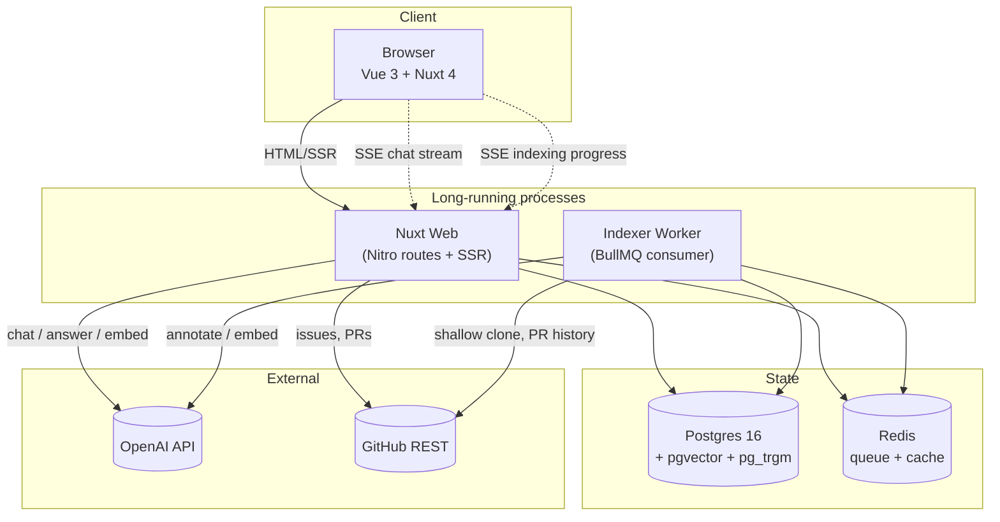
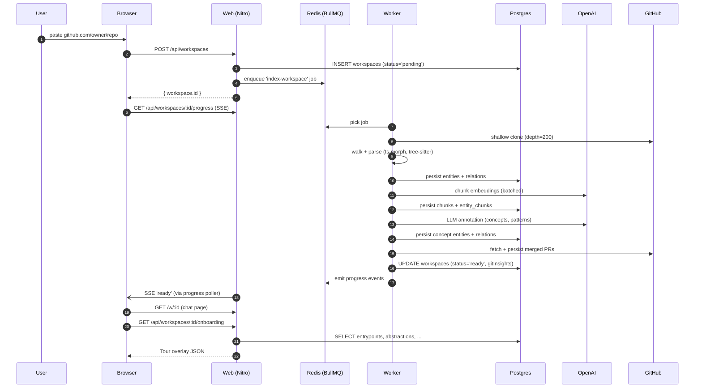
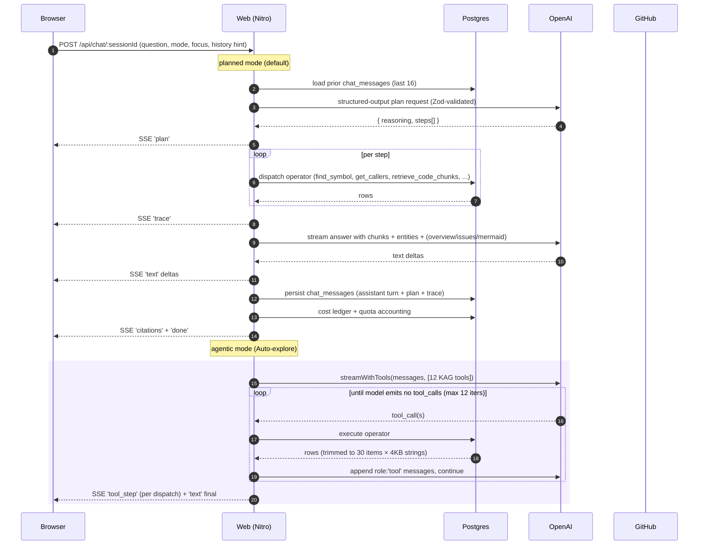
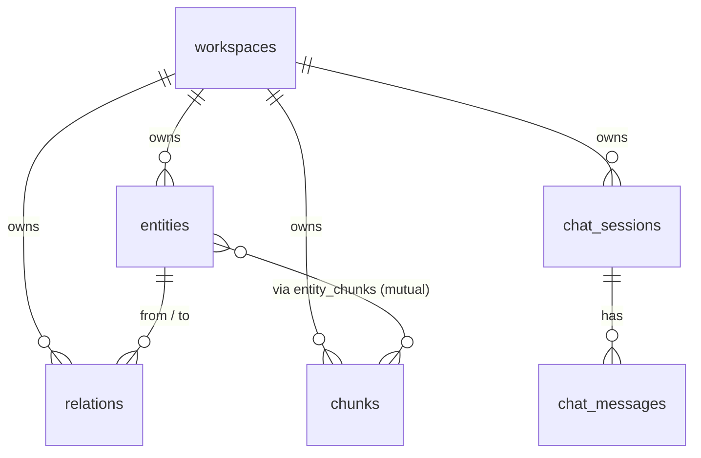

# Architecture

A bird's-eye view of how RepoBuddy goes from "user pastes a GitHub URL" to "user gets a cited answer in chat."

## Process topology

There are two long-running processes plus three stateful services:



**Why split web and worker:** indexing is CPU- and IO-heavy (AST parsing, LLM calls, embedding batches). Keeping it out of the Nitro request loop means chat latency is independent of how many repos are mid-index. The worker bundles separately (`server/workers/build.ts`) so Nuxt's tree-shaking doesn't drop the BullMQ entrypoint.

## End-to-end: "I just pasted a GitHub URL"



## End-to-end: "I asked the chat a question"



## Data model — the five load-bearing tables



- `entities` — graph nodes. `type` is one of `file | module | class | function | type | variable | component | route | test | concept | pattern | decision | commit | pull_request | person | document`. Carries a JSONB `metadata` for type-specific fields (commit sha + diff, PR refs, etc.) and a `vector(1536)` embedding once the LLM-annotation pass has summarised it.
- `relations` — graph edges. `type` is one of `imports | calls | extends | implements | uses_type | defined_in | contained_in | renders | handles | tested_by | implements_concept | follows_pattern | mentioned_in | modified_by | authored | introduced_in | relates_to`.
- `chunks` — code/doc/diff slices keyed by `(workspace_id, file_path, start_line, end_line)`. Carries text + `vector(1536)` + a generated `tsvector` column for hybrid search.
- `entity_chunks` — many-to-many between entities and chunks. Lets the answer operator hydrate citations both ways: from entity → its code, from chunk → its enclosing entity.
- `chat_sessions` / `chat_messages` — assistant memory + saved `plan` and `trace` JSONB per assistant turn, used by the Reasoning Inspector when replaying history.

Full schema: [`server/db/schema.ts`](../server/db/schema.ts).

## Key file pointers

| Concern | Location |
| --- | --- |
| Indexer orchestration | `server/indexer/pipeline.ts` |
| Source fetch (clone, ZIP, lang detect) | `server/indexer/source/` |
| Parsers (TS/JS, Python, Go) | `server/indexer/parsers/` |
| AST-aware chunker | `server/indexer/chunking/chunker.ts` |
| LLM annotation | `server/indexer/annotate.ts` |
| Entity resolution (dedup) | `server/indexer/resolve.ts` |
| PR history fetch | `server/indexer/pr-history.ts` |
| KAG operators (20 of them) | `server/kag/operators/index.ts` |
| Planner (LLM → Zod-validated JSON) | `server/kag/planner.ts` |
| Executor (topo sort + `$sN` resolver) | `server/kag/executor.ts` |
| Agentic loop (tool-use) | `server/kag/agentic.ts` |
| Chat endpoint | `server/api/chat/[sessionId].post.ts` |
| Project overview (Tour data) | `server/lib/project-overview.ts` |
| LLM provider abstraction | `server/providers/llm.ts` |
| Embeddings provider | `server/providers/embeddings.ts` |
| Cost / quota guardrails | `server/lib/cost-log.ts`, `server/lib/quotas.ts` |
| Chat composable | `app/composables/useChat.ts` |
| Message render + lazy mermaid/shiki | `app/components/ChatMessage.vue` |
| Reasoning Inspector | `app/components/ReasoningInspector.vue` |
| Tour overlay | `app/components/WorkspaceOnboarding.vue` |
| Treemap | `app/components/WorkspaceTreemap.vue` |
| Neighbour graph drawer | `app/components/EntityNeighbourGraph.vue` |

## Operational guardrails

- **Cost** — `LLM_BUDGET_USD_PER_INDEX` (default ~$3) hard-stops a run if the annotation step would exceed it. Per-user `users.user_quotas` (workspaces / messages / tokens per day) gate runtime usage.
- **Rate limits** — Octokit anonymous (60 req/h per IP) is the only external rate, used by `list_issues` / `list_prs` / `find_similar_issues` / PR-history indexer. All wrap try/catch and degrade gracefully.
- **Backoff** — `server/providers/embeddings.ts` uses a token-bucket rate limit + exponential backoff on 429s.
- **Observability** — Pino structured JSON logs with `AsyncLocalStorage`-backed `traceId`. Prometheus metrics (`repobuddy_chat_requests_total`, `repobuddy_llm_cost_cents_total`, `repobuddy_queue_depth`, etc.). Loki collects container stdout, Grafana panels in `infra/grafana/dashboards/*.json`.
- **Idempotency** — every indexer step is wrapped in `try { ... } catch { workspace.error + status='failed' }`. Re-index truncates per-workspace state and re-runs; `entities` and `pull_request` rows use `(workspace_id, qualified_name)` unique constraint with `ON CONFLICT DO NOTHING` so re-runs are safe.

## Where this differs from "plain RAG"

Most "chat with your code" tools follow:

```
question → embed → similarity-search chunks → LLM answer
```

That fails for any question that needs traversal ("who calls X?"), enumeration ("list all routes"), or anchoring on a specific issue/PR/commit. We build a **knowledge-augmented graph** (KAG): entities + relations are first-class, and the LLM picks operators to traverse the graph instead of just retrieving raw text.

Detailed walkthrough: [`docs/kag-planning.md`](kag-planning.md).
