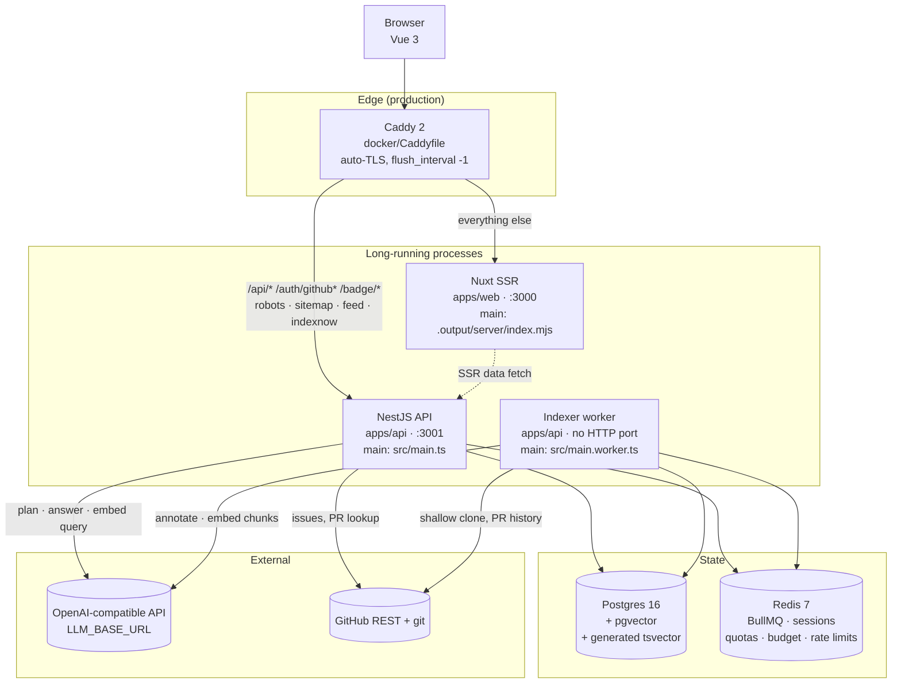
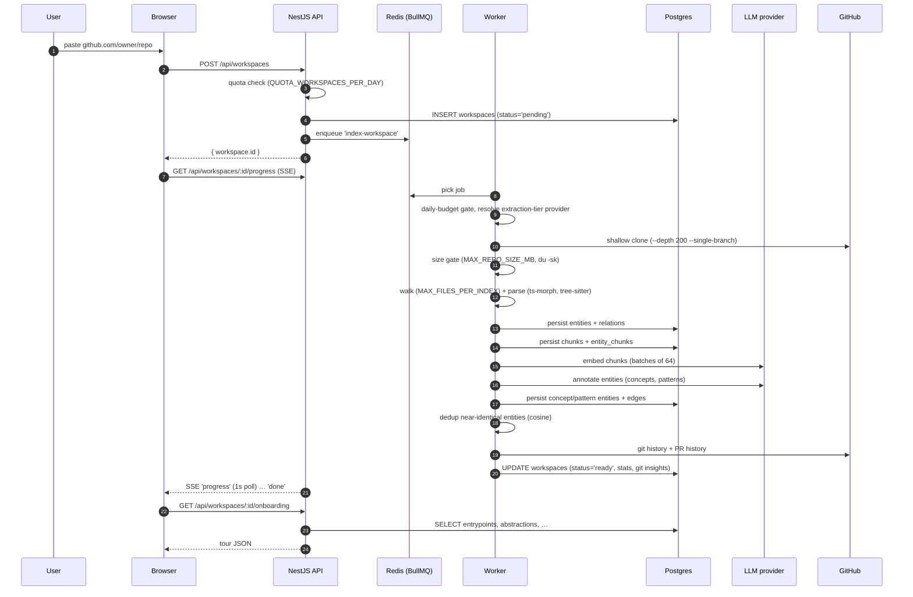
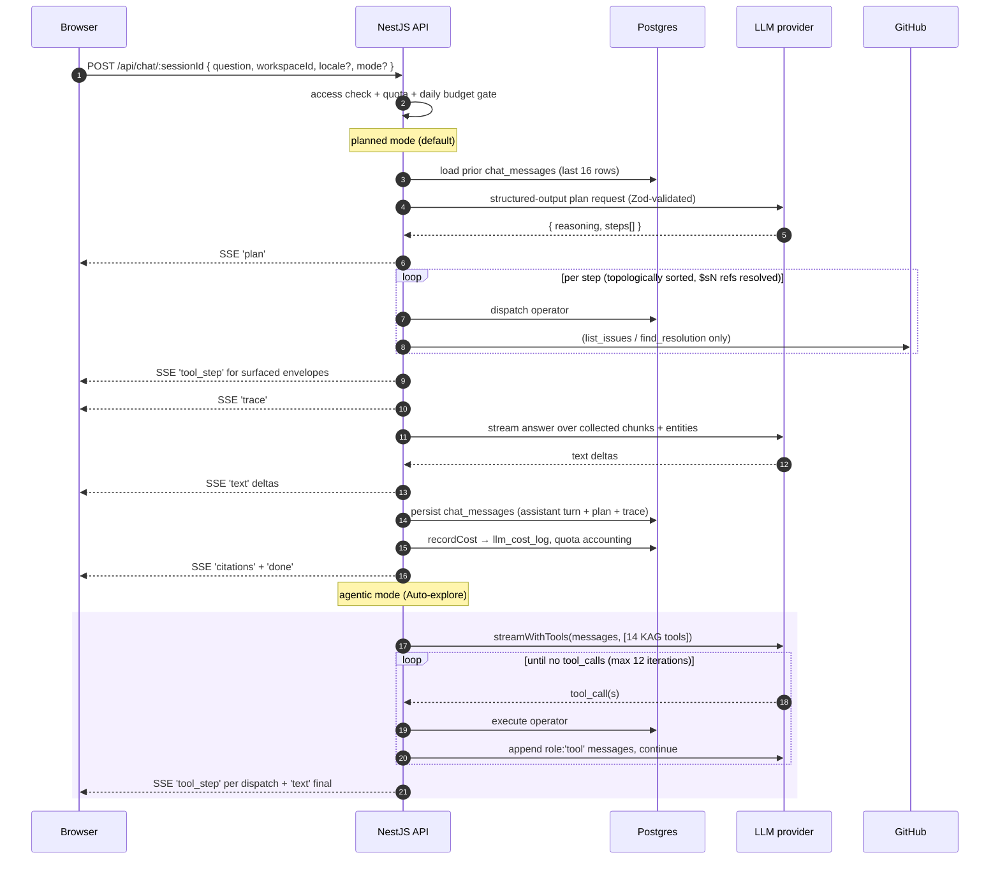
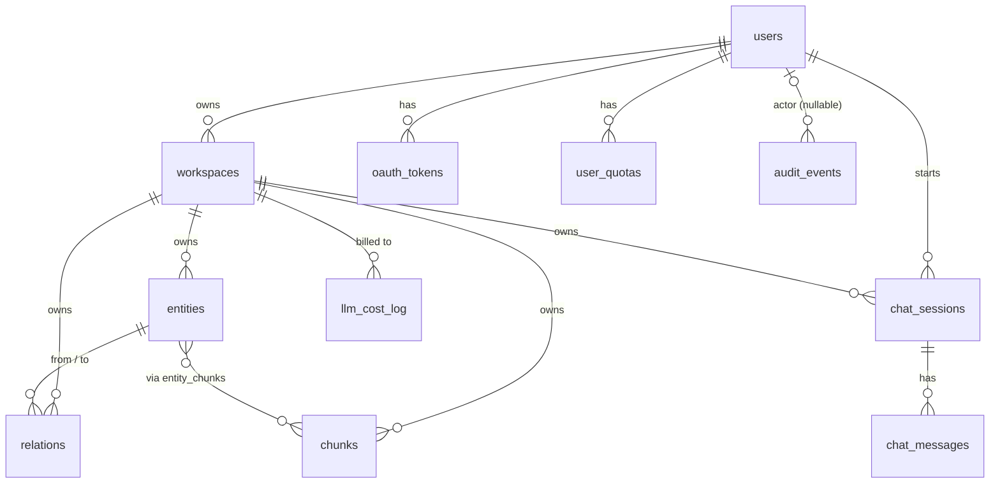

# Architecture

A bird's-eye view of how RepoBuddy goes from "user pastes a GitHub URL" to "user gets a cited answer in chat."

The repository is a pnpm monorepo with three workspaces:

| Workspace | What it is |
| --- | --- |
| [`apps/api`](../apps/api) | NestJS 10 on Express. Serves HTTP **and** hosts the BullMQ worker as a second process from the same codebase. |
| [`apps/web`](../apps/web) | Nuxt 4 SSR frontend. No backend logic — it only talks to the API over HTTP/SSE. |
| [`packages/shared`](../packages/shared) | Zod schemas and small helpers shared by both (plan schema, SSE parser, API types). |

## Process topology

Two long-running Node processes, two stateful services, one reverse proxy:



In development there is no Caddy: Nuxt runs on `:3000`, the API on `:3001`, and CORS with credentials bridges the two origins (`WEB_ORIGIN`, set in [`main.ts`](../apps/api/src/main.ts)). Three terminals are required — `pnpm dev:web`, `pnpm dev:api`, `pnpm dev:worker`. The root `pnpm dev` starts only web and api, so indexing will not run under it.

**Why split API and worker.** Indexing is CPU- and IO-heavy: AST parsing, LLM annotation, embedding batches. Keeping it off the HTTP process means chat latency does not depend on how many repos are mid-index. The worker is a plain Nest application *context* — [`NestFactory.createApplicationContext(WorkerRootModule)`](../apps/api/src/main.worker.ts) — so it shares DI, config, logging and the Drizzle client with the API while binding no port and registering no controllers. There is no separate bundling step; both processes run the same TypeScript sources via `tsx`.

## Module map

[`AppModule`](../apps/api/src/app.module.ts) (HTTP) and [`WorkerRootModule`](../apps/api/src/worker.module.ts) (worker) share the infrastructure half of the module list and diverge on the delivery half.

| Module | Loaded by | Responsibility |
| --- | --- | --- |
| [`config`](../apps/api/src/modules/config) | both | `TypedConfigService` over a Zod-validated env ([`lib/env.ts`](../apps/api/src/lib/env.ts)). |
| [`logger`](../apps/api/src/modules/logger) | both | nestjs-pino; `traceId` carried in `AsyncLocalStorage` ([`lib/logger.ts`](../apps/api/src/lib/logger.ts)). |
| [`redis`](../apps/api/src/modules/redis) | both | `REDIS_CLIENT` (ioredis) shared by BullMQ, quotas and rate limits. |
| [`drizzle`](../apps/api/src/modules/drizzle) | both | `DRIZZLE_DB` token; postgres-js + drizzle-orm. |
| [`providers`](../apps/api/src/modules/providers) | both | Resolves `{ llm, embeddings, usesByok }` per user and per tier. |
| [`kag`](../apps/api/src/modules/kag) | both | Planner, executor, agentic loop, the 15 operators. |
| [`indexer`](../apps/api/src/modules/indexer) | both | Pipeline plus the cost guardrails that wrap it. |
| [`queues`](../apps/api/src/modules/queues) | both | `index-workspace` queue definition and job types. |
| [`workers`](../apps/api/src/modules/workers) | worker | BullMQ consumer ([`index-workspace.processor.ts`](../apps/api/src/modules/workers/index-workspace.processor.ts)), concurrency `WORKER_CONCURRENCY`. |
| [`metrics`](../apps/api/src/modules/metrics) | both | Shared prom-client registry; the scrape endpoint is HTTP-only. |
| [`auth`](../apps/api/src/modules/auth) | api | GitHub OAuth via passport-github2, session serializer, `isAdmin`. |
| [`workspaces`](../apps/api/src/modules/workspaces) | api | CRUD, reindex, visibility, read queries, progress SSE. |
| [`chat`](../apps/api/src/modules/chat) | api | The chat SSE endpoint; planned and agentic modes. |
| [`mcp`](../apps/api/src/modules/mcp) | api | Stateless MCP server over the operator core. |
| [`badge`](../apps/api/src/modules/badge) | api | README badge SVGs. |
| [`me`](../apps/api/src/modules/me) | api | `/api/me/{admin,quota,byok}`. |
| [`admin`](../apps/api/src/modules/admin) | api | Admin-guarded users / audit / workspaces / overview / bulk-delete. |
| [`quotas`](../apps/api/src/modules/quotas) · [`cost-log`](../apps/api/src/modules/cost-log) · [`audit`](../apps/api/src/modules/audit) | mixed | DI wrappers over `lib/quotas.ts`, `lib/cost-log.ts`, `lib/audit.ts`. |
| [`health`](../apps/api/src/modules/health) · [`seo-routes`](../apps/api/src/modules/seo-routes) · [`sentry`](../apps/api/src/modules/sentry) | api | Terminus health check, crawler routes, Sentry filter. |

Modules that carry non-trivial logic keep it under `internals/`, which is also where the subpath import aliases point: `#server/kag/*` → `modules/kag/internals/*`, `#server/indexer/*` → `modules/indexer/internals/*`, `#server/providers/*` → `modules/providers/internals/*`. `#shared/*` resolves into `packages/shared/src`.

Most routes sit behind the global `/api` prefix. The exceptions are declared in [`main.ts`](../apps/api/src/main.ts): `/auth/github` and `/auth/github/callback` (so the GitHub App callback URL stays stable), `/badge/:file`, and the SEO routes `robots.txt`, `sitemap.xml`, `feed.xml`, `indexnow/:filename`.

## End-to-end: "I just pasted a GitHub URL"



Progress is not pushed from the worker. The worker writes `workspaces.progress` / `status` rows, and the SSE endpoint ([`workspaces-progress.controller.ts`](../apps/api/src/modules/workspaces/workspaces-progress.controller.ts)) polls that row once a second, emitting a `progress` event only when the serialised payload changed, a `heartbeat` every 15s, and a final `done` once the status reaches `ready` or `failed`. Deliberately naive; `LISTEN/NOTIFY` would slot in behind the same wire format.

Step-by-step detail lives in [`docs/indexing-pipeline.md`](indexing-pipeline.md).

## End-to-end: "I asked the chat a question"



The tool count differs from the operator count on purpose: `answer` is the only streaming operator and the mandatory terminal step of every plan, so the agentic loop exposes the other 14 as tools. [`TOOL_DEFS_MAP`](../apps/api/src/modules/kag/internals/agentic.ts) is typed as `Record<Exclude<OperatorName, 'answer'>, …>`, which makes "added an operator, forgot the tool definition" a compile error rather than a runtime surprise.

The two history numbers in that diagram are different limits, not a contradiction: the chat service loads the last 16 `chat_messages` rows for the session, and the planner renders only the last 6 of those turns (600 chars each) into its prompt — see [`docs/kag-planning.md`](kag-planning.md).

Planning and answering run on the `planning` tier (`gpt-4o` by default). Indexing annotation runs on the `extraction` tier (`gpt-4o-mini` by default) — see [Cost and quotas](#cost-and-quotas).

The full planner/executor design is in [`docs/kag-planning.md`](kag-planning.md).

## SSE streams

Two endpoints stream; both are plain `@Sse()` controllers returning an RxJS `Observable<MessageEvent>`.

| Endpoint | Events |
| --- | --- |
| `GET /api/workspaces/:id/progress` | `progress`, `heartbeat`, `done` |
| `POST /api/chat/:sessionId` | `plan`, `tool_step`, `trace`, `text`, `citations`, `done`, `error` |

Two details are load-bearing. The progress route sets `x-accel-buffering: no`, and Caddy proxies the API with `flush_interval -1` ([`docker/Caddyfile`](../docker/Caddyfile)) — without either, both streams buffer and arrive as one lump at the end. On the client, event payloads that contain newlines are serialised as multiple `data:` lines by the SSE wire format and must be re-joined before parsing; that logic lives once in [`packages/shared/src/lib/sse.ts`](../packages/shared/src/lib/sse.ts) and is unit-tested there rather than reimplemented per consumer.

## Data model

Verbatim from [`apps/api/src/db/schema.ts`](../apps/api/src/db/schema.ts):



- **`users`** — GitHub identity plus optional BYOK columns (`byok_base_url`, `byok_model`, `byok_embedding_model`, `encrypted_byok_api_key`). The key is AES-GCM encrypted at rest with `ENCRYPTION_KEY`; when it is set, that user's LLM and embedding traffic bypasses the server credentials and the server-side budget gates, because they are paying their own bill.
- **`oauth_tokens`** — encrypted GitHub access/refresh tokens, unique per `(user, provider)`.
- **`user_quotas`** — one row per `(user, UTC day)`. Declared in the schema and migrated, but **not currently read or written by application code**: the live quota counters moved to Redis ([`lib/quotas.ts`](../apps/api/src/lib/quotas.ts)) so guests without a user row could be metered too. Treat the table as reserved, not authoritative.
- **`workspaces`** — one indexed repository. Carries `status`, JSONB `progress` and `stats`, `languages[]`, `is_public`, plus `indexed_commit_sha` / `default_branch`, which is what `GET /api/workspaces/:id/freshness` diffs against the repository HEAD to report how many commits the index is behind.
- **`entities`** — graph nodes. `type` is a free-form text column, not an enum. The `EntityType` union in [`packages/shared/src/types/index.ts`](../packages/shared/src/types/index.ts) is the declared vocabulary; the values the current pipeline actually writes are narrower — `file`, `test`, `class`, `function`, `type`, `document`, `concept`, `pattern`, `commit`, `person`, `pull_request`. (`module`, `variable`, `component`, `route` and `decision` are declared but not yet emitted by any parser.) Pull requests are entities of `type='pull_request'`, not a separate table. Carries JSONB `metadata` for type-specific fields (commit sha and diff, `referencedIssues`, file `hotness`) and a `vector(1536)` `embedding` filled from the LLM-written `description`. Unique on `(workspace_id, qualified_name)`; rows with a NULL qualified name (concepts, patterns) skip the constraint. HNSW cosine index on the embedding.
- **`relations`** — graph edges with `from_entity_id` / `to_entity_id`, a free-form `type`, optional `evidence_quote`, `source_chunk_id`, `source_commit_sha` and `weight`. Same story as entity types — the emitted set is `imports`, `calls`, `extends`, `implements`, `defined_in`, `contained_in`, `tested_by`, `implements_concept`, `follows_pattern`, `modified_by`, `authored`; the `RelationType` union additionally declares `uses_type`, `renders`, `handles`, `mentioned_in`, `introduced_in` and `relates_to`, which nothing writes yet. Indexed in both directions on `(workspace_id, entity_id, type)`, which is what makes the traversal operators cheap.
- **`chunks`** — code / doc / diff slices with `source_type`, file path and line range, the raw `text`, a `vector(1536)` embedding, and `text_tsv`. That last column is `GENERATED ALWAYS AS (to_tsvector('english', text)) STORED` with a GIN index, created by raw SQL in [`drizzle/raw/0001_tsvector.sql`](../drizzle/raw/0001_tsvector.sql) because Drizzle cannot express generated columns. Hybrid search fuses the pgvector cosine ranking and the `ts_rank` ranking with Reciprocal Rank Fusion (`k=60`) in [`hybrid_search.ts`](../apps/api/src/modules/kag/internals/operators/hybrid_search.ts).
- **`entity_chunks`** — many-to-many join, primary key `(entity_id, chunk_id)` with a reverse index on `chunk_id`. Lets the answer operator hydrate citations both ways: entity → its source, chunk → its enclosing entity.
- **`chat_sessions`** / **`chat_messages`** — conversation history, with `plan` and `trace` JSONB saved per assistant turn. Replaying a session rebuilds the Reasoning Inspector and the resolution banner from those columns without re-running anything.
- **`audit_events`** — append-only record of noteworthy mutations (create, delete, visibility toggle, BYOK change), with the actor login denormalised so the admin timeline survives a cascade-delete of the user.
- **`llm_cost_log`** — per-call ledger: workspace, `phase` (`indexing` | `planning` | `answering` | `embedding`), model, token counts, `usd_cents`.

Migrations live in [`drizzle/`](../drizzle) and are applied by `pnpm db:migrate`, which runs the generated SQL and then the raw SQL in `drizzle/raw/`, recording the latter in a `_repobuddy_raw_migrations` table. `drizzle/meta/` is committed on purpose — without `_journal.json`, migrations will not run on a fresh clone. There is no automatic migration on container start; the operator runs it.

## Authentication and sessions

GitHub OAuth only; there is no password path.

1. `GET /auth/github` starts the flow ([`github.strategy.ts`](../apps/api/src/modules/auth/github.strategy.ts), passport-github2, `state` for CSRF).
2. `GET /auth/github/callback` completes it. **Both routes live outside the `/api` prefix** so the callback URL registered with the GitHub App is a stable `{API_URL}/auth/github/callback` — it points at the API origin, not the frontend.
3. The session is an `express-session` cookie named `repobuddy-session`, `httpOnly` + `sameSite=lax` + `secure` in production, 7-day lifetime, stored in Redis via connect-redis under the `repobuddy-session:` prefix. That store opens its own node-redis connection, because connect-redis v9 does not speak the ioredis protocol that BullMQ requires of the shared client.
4. Passport serialises only the user id; `AuthService` resolves the row and decides admin status by matching the GitHub login against `ADMIN_LOGINS`.

Anonymous visitors are not anonymous to the quota system. [`GuestCookieMiddleware`](../apps/api/src/common/middleware/guest-cookie.middleware.ts) mints a `repobuddy-guest` UUID cookie for every request so guest usage of public workspaces can be metered. It is excluded from `GET /badge/*`: a badge response is a cacheable image with no per-visitor content, and attaching `Set-Cookie` to something GitHub's image proxy is meant to reuse would be wrong on both counts.

Authorisation on a workspace runs through [`WorkspaceAccessService`](../apps/api/src/modules/workspaces/workspace-access.service.ts), which resolves a viewer to `owner`, `admin` or `guest`. A private workspace returns **404, not 403**, to a non-owner, so the endpoint cannot be used to probe which ids exist. `AuthGuard` and `AdminGuard` in [`common/guards`](../apps/api/src/common/guards) cover the routes that need a session outright.

## Cost and quotas

Four independent layers, each of which can stop work on its own.

**1. Model tiering.** [`IndexerService.run`](../apps/api/src/modules/indexer/indexer.service.ts) asks the provider resolver for `tier: 'extraction'`, so the highest-volume LLM step in the system — one annotation call per candidate entity — runs on `OPENAI_MODEL_EXTRACTION` (default `gpt-4o-mini`). Only planning and answering use `OPENAI_MODEL_PLANNING` (default `gpt-4o`). A user's BYOK model always overrides the tier.

**2. Per-index annotation budget.** `LLM_BUDGET_USD_PER_INDEX` (default `2.0`) is enforced inside [`annotate.ts`](../apps/api/src/modules/indexer/internals/annotate.ts): each of the `ANNOTATION_CONCURRENCY` workers compares accumulated spend against the cap before taking the next entity and stops if it is exhausted. This is a **soft stop, not an abort** — remaining entities are simply left without a description, the index still reaches `ready`, and `stats.annotationBudgetHit = 1` surfaces an honest coverage notice in the UI. `get_summary` returns null for the skipped entities.

Read that number as ledger units, not as a bill. Structured-output calls return no usage data, so the cost estimator approximates (`inputTokens = promptChars / 4`, `outputTokens = 200`) and applies `Math.ceil` to each term separately, which floors every entity at 2 cents against a real cost of roughly 0.035 cents. In practice the default budget stops annotation at around a hundred entities. The estimate is conservative by design, but it is an estimate.

**3. Service-wide daily budget.** `COST_BUDGET_USD_PER_DAY` (default `3`) is a Redis counter at `cg:cost:day:<UTC-date>` with a 48h TTL, fed by the same estimator via [`recordCost`](../apps/api/src/lib/cost-log.ts). `assertWithinDailyBudget` throws a 503 once the cap is reached, and it is checked in three places: the indexer before starting a pipeline (a failed check marks the workspace failed rather than letting BullMQ retry it), the chat service before planning, and the MCP tools service before the two paid tools. Admins and BYOK users bypass it — MCP does not, since it is unauthenticated. Telegram alerts fire at 80% and 100% if `TELEGRAM_BOT_TOKEN` is configured.

Because the estimator is deliberately pessimistic, one index of a medium repository can consume most of the default daily cap on its own, after which non-admin chat and new indexes return 503 until UTC midnight. Raise `COST_BUDGET_USD_PER_DAY` for real use.

**4. Per-user and per-guest daily quotas.** [`lib/quotas.ts`](../apps/api/src/lib/quotas.ts) keeps Redis counters keyed by UTC day (48h TTL) for `QUOTA_WORKSPACES_PER_DAY` (3), `QUOTA_MESSAGES_PER_DAY` (50), `QUOTA_TOKENS_PER_DAY` (200k), with separate lower limits for guests. `GET /api/me/quota` reports the current state and the viewer kind.

Ingestion size is capped separately: `MAX_FILES_PER_INDEX` (default 2000) truncates the walk and sets `stats.filesTruncated = 1`, while `MAX_REPO_SIZE_MB` (default 200) is checked with `du -sk` *after* cloning and fails the workspace outright — the clone traffic is spent either way.

## Key file pointers

| Concern | Location |
| --- | --- |
| API bootstrap (session, CORS, prefix) | [`apps/api/src/main.ts`](../apps/api/src/main.ts) |
| Worker bootstrap | [`apps/api/src/main.worker.ts`](../apps/api/src/main.worker.ts) |
| BullMQ consumer | [`apps/api/src/modules/workers/index-workspace.processor.ts`](../apps/api/src/modules/workers/index-workspace.processor.ts) |
| Indexer orchestration | [`apps/api/src/modules/indexer/internals/pipeline.ts`](../apps/api/src/modules/indexer/internals/pipeline.ts) |
| Indexer cost guardrails | [`apps/api/src/modules/indexer/indexer.service.ts`](../apps/api/src/modules/indexer/indexer.service.ts) |
| Source fetch + walk | [`apps/api/src/modules/indexer/internals/source/`](../apps/api/src/modules/indexer/internals/source) |
| Parsers (TS/JS/Vue, Python, Go) | [`apps/api/src/modules/indexer/internals/parsers/`](../apps/api/src/modules/indexer/internals/parsers) |
| AST-aware chunker | [`apps/api/src/modules/indexer/internals/chunking/chunker.ts`](../apps/api/src/modules/indexer/internals/chunking/chunker.ts) |
| LLM annotation | [`apps/api/src/modules/indexer/internals/annotate.ts`](../apps/api/src/modules/indexer/internals/annotate.ts) |
| Entity resolution (dedup) | [`apps/api/src/modules/indexer/internals/resolution.ts`](../apps/api/src/modules/indexer/internals/resolution.ts) |
| Git + PR history | [`git/history.ts`](../apps/api/src/modules/indexer/internals/git/history.ts), [`pr-history.ts`](../apps/api/src/modules/indexer/internals/pr-history.ts) |
| Progress writers | [`apps/api/src/modules/workspaces/workspace-progress.ts`](../apps/api/src/modules/workspaces/workspace-progress.ts) |
| KAG operators (15 of them) | [`apps/api/src/modules/kag/internals/operators/`](../apps/api/src/modules/kag/internals/operators) |
| Operator registry | [`operators/_registry.ts`](../apps/api/src/modules/kag/internals/operators/_registry.ts) |
| Operator name list (single source) | [`packages/shared/src/schemas/plan.ts`](../packages/shared/src/schemas/plan.ts) |
| Planner (LLM → Zod-validated JSON) | [`apps/api/src/modules/kag/internals/planner.ts`](../apps/api/src/modules/kag/internals/planner.ts) |
| Executor (topo sort + `$sN` resolver) | [`apps/api/src/modules/kag/internals/executor.ts`](../apps/api/src/modules/kag/internals/executor.ts) |
| Agentic loop (tool-use) | [`apps/api/src/modules/kag/internals/agentic.ts`](../apps/api/src/modules/kag/internals/agentic.ts) |
| Chat endpoint | [`chat.controller.ts`](../apps/api/src/modules/chat/chat.controller.ts), [`chat.service.ts`](../apps/api/src/modules/chat/chat.service.ts) |
| MCP server + tools | [`mcp.service.ts`](../apps/api/src/modules/mcp/mcp.service.ts), [`internals/tools.service.ts`](../apps/api/src/modules/mcp/internals/tools.service.ts) |
| README badge | [`badge.controller.ts`](../apps/api/src/modules/badge/badge.controller.ts), [`internals/svg.ts`](../apps/api/src/modules/badge/internals/svg.ts) |
| Project overview (tour data) | [`apps/api/src/lib/project-overview.ts`](../apps/api/src/lib/project-overview.ts) |
| LLM / embeddings providers | [`internals/llm.ts`](../apps/api/src/modules/providers/internals/llm.ts), [`internals/embeddings.ts`](../apps/api/src/modules/providers/internals/embeddings.ts) |
| Cost ledger / quotas / rate limits | [`lib/cost-log.ts`](../apps/api/src/lib/cost-log.ts), [`lib/quotas.ts`](../apps/api/src/lib/quotas.ts), [`lib/rate-limit.ts`](../apps/api/src/lib/rate-limit.ts) |
| DB schema | [`apps/api/src/db/schema.ts`](../apps/api/src/db/schema.ts) |
| Reverse proxy config | [`docker/Caddyfile`](../docker/Caddyfile) |
| Chat composable + SSE parser | [`apps/web/app/composables/useChat.ts`](../apps/web/app/composables/useChat.ts), [`packages/shared/src/lib/sse.ts`](../packages/shared/src/lib/sse.ts) |
| Message render + lazy mermaid/shiki | [`apps/web/app/components/ChatMessage.vue`](../apps/web/app/components/ChatMessage.vue) |
| Reasoning Inspector | [`apps/web/app/components/ReasoningInspector.vue`](../apps/web/app/components/ReasoningInspector.vue) |
| Resolution banner | [`apps/web/app/components/ChatResolutionBanner.vue`](../apps/web/app/components/ChatResolutionBanner.vue) |
| Tour overlay | [`apps/web/app/components/WorkspaceOnboarding.vue`](../apps/web/app/components/WorkspaceOnboarding.vue) |
| Treemap / neighbour graph | [`WorkspaceTreemap.vue`](../apps/web/app/components/WorkspaceTreemap.vue), [`EntityNeighbourGraph.vue`](../apps/web/app/components/EntityNeighbourGraph.vue) |

## Operational guardrails

- **Failure handling** — the pipeline runs inside one outer `try`; per-file reads and the PR-history step have their own local `try/catch` so a single bad file or a GitHub rate limit degrades into a warning instead of failing the run. On an unhandled error `markWorkspaceFailed` stores the unwrapped cause (Postgres `code` / `detail` / `table` when present), and the temp clone directory is removed in `finally` regardless.
- **Idempotency** — re-indexing is throw-away-and-rebuild: `clearWorkspaceGraph` wipes the workspace's graph before the new one is written, and inserts use `ON CONFLICT DO NOTHING` against `entities_workspace_qualified_name_unique`, so a re-run converges rather than duplicating. `POST /api/workspaces/:id/reindex` returns 409 while a run is already in flight.
- **External rate limits** — GitHub is the only external limit that bites. Anonymous Octokit gets 60 req/h per IP; setting `GITHUB_TOKEN` (read-only public scope is enough) raises it to 5000. `list_issues`, `find_resolution` and the PR-history indexer all wrap their calls and degrade to a stated reason rather than failing. Inbound limits are per-IP: 120 req/h plus a 10 req/10s burst on `/api/mcp`, 60 req/min on `/badge/*`.
- **Backoff** — [`embeddings.ts`](../apps/api/src/modules/providers/internals/embeddings.ts) retries 429s and 5xx with exponential backoff capped at 16s, batches 100 inputs per provider request, and truncates each input to 8000 tokens via gpt-tokenizer. There is no client-side token bucket.
- **Observability** — Pino structured JSON with an `AsyncLocalStorage`-backed `traceId`; Prometheus counters and histograms (`repobuddy_chat_requests_total`, `repobuddy_llm_cost_cents_total`, `repobuddy_queue_depth`, `repobuddy_kag_operator_latency_seconds`, …) in [`lib/metrics.ts`](../apps/api/src/lib/metrics.ts). `GET /api/metrics` requires `Authorization: Bearer $METRICS_TOKEN`; with no token configured it returns 404 in production and stays open in dev. The dev compose file additionally starts Prometheus, Loki, Promtail and Grafana.
- **Health** — `GET /api/health` (Terminus) checks Postgres with `select 1` and Redis with `ping`, reporting `latencyMs` for each.
- **Known compromise** — production runs the API and worker through `tsx` rather than a compiled `dist/`. `nest build` with swc is configured, but swc rewrites the `#shared/*` and `#server/*` subpath aliases into relative paths that break once they move into `dist/`; closing that gap needs `tsc-alias` or a migration of the affected imports. It costs cold-start time and memory, and it is a deliberate trade rather than an oversight.

## Where this differs from "plain RAG"

Most "chat with your code" tools follow:

```
question → embed → similarity-search chunks → LLM answer
```

That fails for any question needing traversal ("who calls X?"), enumeration ("list every route"), or anchoring on a specific issue, PR or commit. RepoBuddy builds a knowledge-augmented graph instead: entities and relations are first-class rows, and the planner picks operators to traverse them rather than only retrieving text. Vector search remains one of the fifteen operators — it is a tool the planner reaches for, not the whole retrieval strategy.

Detailed walkthrough: [`docs/kag-planning.md`](kag-planning.md).
