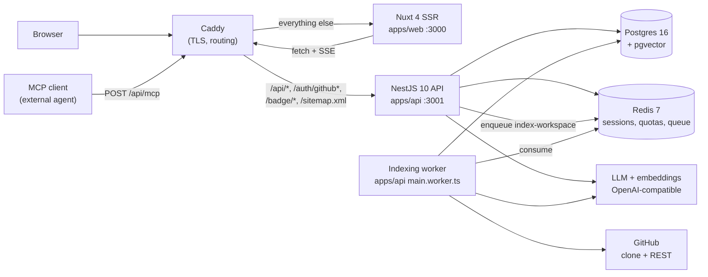

> **Draft — not documentation.** This is an unpublished article draft kept in the
> repository for convenience. It is written to be read as a narrative, not as a
> reference. For the actual reference material see
> [architecture](architecture.md), [KAG planning](kag-planning.md),
> [indexing pipeline](indexing-pipeline.md) and [frontend tour](frontend.md).
> Where this file and those files disagree, they win.

# Building 28 operators and shipping 15

RepoBuddy indexes a public GitHub repository into a typed knowledge graph
(Postgres + pgvector) and answers questions about the code with citations.
This is a write-up of two things: how the knowledge-graph-plus-planner
architecture came together, and what a product audit did to it afterwards —
which is the more useful half of the story.

The short version: the interesting engineering was in the graph and the
planner, and the interesting product decision was cutting a third of the
operator catalogue, moving the engine behind an MCP endpoint, and pointing the
whole thing at repository maintainers instead of at "chat with your code",
which stopped being a product category some time in the last two years.

Status up front, so nothing below reads as a claim it isn't: **the project is
not deployed.** There is no hosted instance and no live demo. Everything here
runs from a `docker compose` file on your own machine.

---

## Part 1 — why a graph

### The shape of plain RAG

Nearly every AI-over-code tool starts from the same pipeline:

```
question → embed(question) → similar-chunks(vector_db) → LLM(chunks + question) → answer
```

This is genuinely good at surface questions. "What does the README say about
installation?" and "find something that mentions JWT" are similarity problems,
and similarity search solves them.

It degrades badly on four other question shapes:

- **Traversal.** "Who calls `processPayment`, transitively, two hops deep?"
  There is no embedding-similarity signal between a caller and a callee. They
  frequently share no vocabulary at all.
- **Enumeration.** "List every HTTP route." That's a set query. Ranking by
  cosine distance returns *some* routes, ordered by nothing meaningful, with no
  way to know whether the set is complete.
- **Anchored reasoning.** "I want to work on issue #191 — where do I start?"
  The issue body is not in the index. The paths it mentions have to be resolved
  against real entities. The functions those paths contain have callers that
  need inspecting.
- **Cross-source linking.** "Has this already been fixed?" needs commit
  messages and pull requests, not chunk similarity.

A better embedding model does not fix any of these. The data shape is wrong.

### KAG: typed graph plus an operator planner

The alternative inverts the pipeline:

```
question → planner(LLM + operator catalogue) → typed plan → executor → operator results → LLM(grounded) → answer
```

The repository is indexed once into a typed graph. Nodes are entities — 16
declared types (`file`, `module`, `class`, `function`, `type`, `variable`,
`component`, `route`, `test`, `concept`, `pattern`, `decision`, `commit`,
`pull_request`, `person`, `document`). Edges are relations — 17 declared types
(`imports`, `calls`, `extends`, `implements`, `uses_type`, `defined_in`,
`contained_in`, `renders`, `handles`, `tested_by`, `implements_concept`,
`follows_pattern`, `mentioned_in`, `modified_by`, `authored`, `introduced_in`,
`relates_to`). Both unions live in
[`packages/shared/src/types/index.ts`](../packages/shared/src/types/index.ts).
Worth being precise: those are TypeScript unions and a shared convention. The
underlying columns in
[`apps/api/src/db/schema.ts`](../apps/api/src/db/schema.ts) are plain `text` —
the database does not enforce the vocabulary, the code does.

Text chunks still exist and still get embedded; they live beside the graph and
are joined to entities through a mutual `entity_chunks` index. The graph does
not replace retrieval, it gives retrieval somewhere to stand.

On top of the graph sits a catalogue of **15 operators**
([`packages/shared/src/schemas/plan.ts`](../packages/shared/src/schemas/plan.ts)):

| Family | Operators |
| --- | --- |
| Lookup | `find_symbol`, `read_file`, `get_project_overview` |
| Graph traversal | `get_callers`, `get_callees`, `walkthrough`, `tests_for` |
| Search | `hybrid_search`, `search_docs` |
| Retrieve | `retrieve_code_chunks`, `get_summary` |
| History | `git_history` |
| GitHub | `list_issues`, `find_resolution` |
| Sink | `answer` |

An LLM planner receives the question, a prose catalogue of the operators and
eight few-shot plans, and emits JSON validated against a Zod schema
([`planner.ts`](../apps/api/src/modules/kag/internals/planner.ts)). An executor
topologically sorts the steps by their `$sN` references, dispatches operators,
and feeds the accumulated results into a final `answer` step
([`executor.ts`](../apps/api/src/modules/kag/internals/executor.ts)). The plan
and the execution trace are persisted on the assistant message, so a Reasoning
Inspector can replay them later.

### What a plan actually looks like

For *"I want to work on issue #42 — where do I start in the code?"* the planner
is required to produce six steps, and the first one is not a search:

```json
{
  "reasoning": "Specific issue — check for an existing resolution FIRST (merged fix / in-flight PR / duplicate), then fetch the issue and expand the top relatedEntities (walkthrough + callers) so the answer can ground in real code, not just point back to GitHub.",
  "steps": [
    { "id": "s1", "op": "find_resolution", "params": { "issueNumber": 42 } },
    { "id": "s2", "op": "list_issues", "params": { "issueNumber": 42 } },
    { "id": "s3", "op": "walkthrough", "params": { "entity": "$s2.issues[0].relatedEntities", "limit": 8 } },
    { "id": "s4", "op": "get_callers", "params": { "target": "$s2.issues[0].relatedEntities", "transitive": false, "limit": 12 } },
    { "id": "s5", "op": "retrieve_code_chunks", "params": { "entities": "$s4" } },
    {
      "id": "s6",
      "op": "answer",
      "params": {
        "question": "I want to work on issue #42 — where do I start in the code?",
        "context": ["$s1", "$s2", "$s3", "$s4", "$s5"],
        "style": "detailed"
      }
    }
  ]
}
```

Three things worth noticing.

**`$s2.issues[0].relatedEntities`.** The executor carries a small reference
resolver that walks `.field` and `[idx]` selectors over previous results. The
planner can chain typed pipelines without the model inventing a variable scheme
of its own.

**`list_issues` is not a chunk search.** It calls the GitHub REST API against
the workspace's source repository, extracts file paths and backticked
identifiers from the issue body, and resolves them against indexed entities.
Its output already contains the `relatedEntities` array that the next step
consumes.

**The planner is not freeform.** Operator names come from a Zod enum; a
validation failure retries once with the error fed back into the prompt, and a
second failure drops to a deterministic `hybrid_search → answer` plan. The user
never sees a dead end, only a less clever answer.

### Where the graph actually wins

`get_callers` is a recursive CTE over the `relations` table filtered to
`type='calls'`
([`traversal.ts`](../apps/api/src/modules/kag/internals/operators/traversal.ts)).
Vector search will never reliably find a function that does not lexically
resemble the thing it calls. `tests_for` matches `type='tested_by'`, an edge
the indexer derives from the `imports` edges of test files. These are SQL
queries on indexed columns: milliseconds, and either correct or empty — never
plausibly wrong.

The embedding path is still the right tool for "where is discount logic
implemented?" — that question has no symbol to anchor on. `hybrid_search`
combines pgvector cosine distance with Postgres `ts_rank` over a generated
tsvector column, merged with reciprocal rank fusion
([`hybrid_search.ts`](../apps/api/src/modules/kag/internals/operators/hybrid_search.ts)).
The point was never that graphs beat embeddings; it's that a planner that can
choose between them beats a pipeline that only has one.

### Agentic mode as the second pipeline

Planned mode commits to a plan up front. That is right most of the time, and
predictably wrong the rest of the time, which is a good property. But some
questions need reaction to intermediate results. For those there is an agentic
loop that exposes the catalogue as function-calling tools
([`agentic.ts`](../apps/api/src/modules/kag/internals/agentic.ts)):

```ts
// shape of the loop
const messages = [systemPrompt, ...history, { role: 'user', content: question }]
while (iteration < maxIterations /* 12 */) {
  const result = await llm.streamWithTools(messages, TOOL_DEFS)
  if (!result.toolCalls?.length) break // model produced final text
  for (const call of result.toolCalls) {
    const out = await operators[call.name](call.parsedArgs, ctx)
    messages.push({ role: 'tool', tool_call_id: call.id, content: trimToolResult(out) })
  }
}
```

`trimToolResult` matters: arrays are cut to 30 items and strings to 4000
characters before results re-enter the prompt, so a `list_issues` returning
sixty issues doesn't detonate the next turn's input.

Agentic mode sits behind an "Auto-explore" checkbox because it is structurally
more expensive — up to twelve model round-trips against planned mode's two (one
plan, one answer). Planned is the default deliberately.

One detail from the type system that paid for itself repeatedly: `TOOL_DEFS_MAP`
is declared as `Record<Exclude<OperatorName, 'answer'>, …>`. Add an operator to
the enum and the build breaks until you write its tool definition. That covers
14 of the 15; `answer` is the implicit final text turn.

---

## Part 2 — the audit

By spring the catalogue had 28 operators. That felt like progress at the time.
It was mostly surface area.

The audit was a boring exercise: for each operator, when was the last time a
plan used it, and when it did, did anything from its result reach the user's
answer? Thirteen operators failed that test, and they failed it in four
distinct ways.

**Duplicates of a survivor.** `find_file` did a subset of `read_file` plus
`find_symbol`. `vector_search_chunks` was `hybrid_search` with the full-text
half disabled — strictly worse and never deliberately chosen.
`find_by_concept` searched LLM-written entity descriptions, which
`hybrid_search` already covers. `list_concepts` was `find_symbol({ type:
'concept' })` with its own name. Each one gave the planner a chance to pick the
weaker path.

**Graph edges too sparse to be worth an operator.** `get_dependencies` /
`get_dependents` walked `imports`, which in practice resolves at file
granularity and answers a question almost nobody asks in those words.
`find_implementations` walked `extends` / `implements`, which are genuinely
rare edges in the languages the parser supports.

**Fragments of an answer that should have been one envelope.** `list_prs`,
`find_similar_issues` and `find_prs_for_issue` each returned a slice of the
same underlying question: *has this already been dealt with?* Three operators,
three plan steps, and the LLM had to assemble the conclusion itself — with the
usual result that it sometimes didn't. They became fields inside one
`find_resolution` envelope: `mergedByCommits`, `linkedPullRequests`,
`duplicateCandidates`, plus a `status` bucket the UI can act on
(`merged | open_pr | draft_pr | stale_pr | duplicate_closed | related | none`).
See [`github.ts`](../apps/api/src/modules/kag/internals/operators/github.ts).

**Different product.** `web_search` and `web_fetch` turned a repository
explainer into a general research agent, which is a thing that exists and is
not this. `propose_edit` wrote code — a feature that only makes sense with a
review flow, write permissions and a diff UI behind it, none of which were
built. A `self-critique` pass was cut alongside them; the UI had never exposed
a way to turn it on.

The cut removed 1264 lines. Not one of the eight planner few-shots lost a
scenario it could express.

### What the cut was actually about

Every operator you add is a line in a prose catalogue inside the planner's
system prompt. That prompt is a fixed budget. Twenty-eight entries meant each
one got a terse description, and near-synonyms sat next to each other with no
guidance on which to prefer — so the model picked by vibes. Fifteen entries
means each gets a real description with a usage rule, and `find_resolution`'s
entry can afford the sentence that says *plans about "issue #N" must start with
this step.*

Cutting the catalogue improved plan quality without touching the model. That
was the surprising part.

### The consequence: `find_resolution` reaching the answer

`find_resolution` existed before the audit and was largely wasted, because its
result only got surfaced in agentic mode — behind a checkbox almost nobody
turned on. Three changes fixed that:

1. The planner rule now requires it as step one for any specific-issue
   question, and the corresponding few-shot demonstrates it.
2. `answerOp` unpacks the `ResolutionEnvelope` into a dedicated "resolution
   status" section of the prompt, so the answer states plainly whether the
   issue is already fixed instead of investigating a solved bug from scratch.
3. The executor emits a `tool_step` trace entry carrying the full result for
   operators in `TOOL_RESULTS_SURFACED_TO_UI` — currently just this one — so
   `ChatResolutionBanner.vue` renders in planned mode too, and survives a page
   reload because the trace is persisted.

The behaviour worth having was already implemented. What was missing was the
path from it to the screen.

### The engine goes outside: MCP

The operators are Nest-injectable classes collected into a registry. That means
the HTTP chat endpoint is one consumer of the engine, not the engine itself.
The second consumer is an MCP server at `POST /api/mcp`
([`mcp.service.ts`](../apps/api/src/modules/mcp/mcp.service.ts)), exposing nine
tools ([`tools.service.ts`](../apps/api/src/modules/mcp/internals/tools.service.ts)):
`list_workspaces`, `search_code`, `find_symbol`, `get_callers`, `walkthrough`,
`read_file`, `get_project_overview`, `list_issues`, `find_resolution`.

They are projections of the operators, not reimplementations, with tighter caps
because the consumer is somebody else's agent: chunk text truncated to 1200
characters (2400 for `read_file`), lists capped, and a `counts` block reporting
the true lengths so the caller knows what it isn't seeing.

The transport is stateless Streamable HTTP. `GET` and `DELETE` return 405 with
an `Allow: POST` header — there are no sessions to stream into or tear down.
JSON-RPC batches are rejected with 400. The endpoint is unauthenticated and
only ever loads public workspaces, which is enforced structurally: a single
`loadPublicWorkspace` helper is the only path to a workspace row, so a private
one is unreachable rather than merely forbidden. Rate limiting is 120 requests
per hour per IP plus a 10-per-10-seconds burst, and the two paid tools
(`search_code` and `find_resolution` both embed) check the global daily budget
before running.

Building this took about a day, because the hard part — a typed operator layer
with stable result shapes — was already the product. That is the best argument
I have for the operator design: it survived being pointed at a different
consumer.

### Positioning: maintainers, not "chat with your code"

Here is the part that has nothing to do with code.

"Chat with your repository" was a defensible product in 2024. In 2026 it is a
commodity: DeepWiki generates browsable wikis for public repositories for free,
Copilot answers questions about code inside the editor where the code already
is, and every code host ships some version of it. A self-hosted chat UI over a
graph you have to index yourself does not win that comparison, and shouldn't.

What is not commodity is the maintainer's side of the same data. A new
contributor opens an issue that was fixed three weeks ago. Someone starts work
on a bug that already has a draft PR. A first-time contributor asks where to
start and gets pointed at a file rather than a call chain. These cost
maintainer attention, repeatedly, and none of the generic tools address them
because they answer questions about code rather than about the state of the
project's work.

So the surfaces the audit kept and added are maintainer-shaped:

- `find_resolution` as a first-class step, answering *is this already handled?*
  before anything else.
- `get_project_overview` returning entrypoints, core abstractions, good-first
  issues, hot files and the contribution guide — the contents of the onboarding
  conversation a maintainer has repeatedly.
- A README badge (`GET /badge/<workspaceId>.svg`) that links a repository to
  its indexed workspace, with a copy-ready snippet in the workspace page.
- An MCP endpoint, so the answer can arrive inside the contributor's own agent
  instead of requiring them to visit a website.

The badge has one deliberate limitation worth stating: it does not show index
freshness. It could, and then the image in a README would change on every
upstream commit, which is worse than useless. Freshness lives in the app
instead — `GET /api/workspaces/:id/freshness` returns the indexed SHA and how
many commits behind HEAD it is, and the workspace page shows it.

This is a narrower product than "ask anything about any repository". Narrower
is the point.

---

## Part 3 — the economics the audit also found

An indexing pipeline that calls an LLM per entity is a cost surface, and this
one had a plain bug in it: annotation ran on the planning-tier model.

The provider resolver has two tiers
([`resolve.ts`](../apps/api/src/modules/providers/internals/resolve.ts)):
`planning` (default `gpt-4o`) and `extraction` (default `gpt-4o-mini`). Chat
planning and answering legitimately want the stronger model. Annotation — one
call per class, function or module over eight lines, which is by far the
highest call count in the system — does not. It now requests `extraction`
([`indexer.service.ts`](../apps/api/src/modules/indexer/indexer.service.ts)).
A user's own BYOK model always wins over both.

`LLM_BUDGET_USD_PER_INDEX` (default 2.0) had been a documented knob that
enforced nothing. It is now checked inside
[`annotate.ts`](../apps/api/src/modules/indexer/internals/annotate.ts): each of
the `ANNOTATION_CONCURRENCY` workers compares accumulated spend against the cap
at the top of its loop and stops when exhausted. Crucially it stops the phase,
not the run — remaining entities simply have no description, the index still
reaches `ready`, and `stats.annotationBudgetHit = 1` propagates to an honest
coverage notice in the UI. Same treatment for `MAX_FILES_PER_INDEX`
(default 2000): the walk stops, `stats.filesTruncated = 1` is set, and the page
says the index covers only part of the repository. `MAX_REPO_SIZE_MB` (default
200) is a hard refusal rather than a truncation, checked with `du -sk` after
the clone.

Now the honest part about that budget, because it is easy to describe
misleadingly. The structured-output call doesn't return usage, so annotation
estimates: input tokens as `ceil(promptChars / 4)`, output as a flat 200. Then
`Math.ceil` is applied to **each** cost term separately, which floors every
entity at 2 cents against a real cost around 0.035 cents. So the default $2 cap
stops annotation at roughly a hundred entities, and it is a conservative
tripwire measured in ledger currency, not a $2 bill. The same estimator feeds
`llm_cost_log` and the Redis daily counter, which means one medium repository
nearly exhausts the default `COST_BUDGET_USD_PER_DAY=3` by internal accounting
while the actual OpenAI charge for the same run is on the order of ten to
twenty cents.

I am leaving it conservative rather than "fixing" it to be accurate. A cost
guard that overestimates fails toward a partially-annotated index; one that
underestimates fails toward a surprise invoice. But it has to be documented as
what it is, and it previously wasn't.

---

## Part 4 — frontend pieces worth a look

A few decisions that don't show up in an architecture diagram.

### Lazy heavy renderers

`mermaid` and `shiki` are both large enough to notice, and a chat with no code
blocks and no diagrams should download neither. Both load through dynamic
`import()` inside the DOM post-processor that runs after the markdown pass, in
[`ChatMessage.vue`](../apps/web/app/components/ChatMessage.vue)
(`renderMermaidBlocks` and `highlightCodeBlocks`). The mermaid module is cached
in a module-level promise so a session pays for it once.

Mermaid earns its weight through `walkthrough`, which gathers a target's
callees, covering tests and enclosing parent and emits a sequence-diagram
source alongside the entity array. The `answer` operator injects that source
into the prompt with an instruction to include it in a fenced block; the
component renders it to SVG and sanitises with DOMPurify's SVG profile. A
twelve-step call chain becomes readable in a glance instead of five minutes of
tab-switching.

### Dual-theme syntax highlighting via CSS variables

Shiki's single-theme API bakes colours into inline `style` attributes. Toggle
the site theme and those are stuck — a white code block sitting on a dark
surface until something forces a re-render. The fix is dual-theme with
`defaultColor: false`:

```ts
const rendered = await codeToHtml(source, {
  lang,
  themes: { light: 'github-light', dark: 'github-dark' },
  defaultColor: false,
})
```

which emits variables per span:

```html
<span style="--shiki-light: #008; --shiki-dark: #88f;">…</span>
```

and one global rule maps them off the `.dark` class:

```css
.shiki, .shiki span { color: var(--shiki-light); background-color: var(--shiki-light-bg); }
.dark .shiki, .dark .shiki span { color: var(--shiki-dark); background-color: var(--shiki-dark-bg); }
```

Theme switching becomes pure CSS. No re-render, no flash, no highlighter state
to keep in sync with the color-mode store. The amount of complexity this
removes is disproportionate to the size of the change.

### Citations validated server-side

The `answer` prompt allows exactly three citation forms: `[chunk:UUID]` for
code claims, `[entity:UUID]` for entity claims, and `[#42](issue-url)` for
GitHub issues — explicitly never `[entity:42]`, which the model reached for
early and often, having evidently learned that a number in citation brackets is
a reasonable thing to write.

After the stream completes, `extractCitations`
([`answer.ts`](../apps/api/src/modules/kag/internals/operators/answer.ts))
regex-collects every citation from the assembled text, the chat service
validates the chunk IDs against actual rows for that workspace, and emits an
`invalid: string[]` list to the client, which renders those badges in a warning
colour. Roughly forty lines total, and it converts a silent hallucination into
a visible one.

### Robust SSE parsing

Joining SSE `data:` lines with `''` collapses `### Heading` and a following
`- item` into `"### Heading- item"`. The spec says join with `\n` and strip
exactly one leading `U+0020` per line. The parser is extracted into
[`packages/shared/src/lib/sse.ts`](../packages/shared/src/lib/sse.ts) and
unit-tested on its own, rather than living inline in the chat composable.

Both server-side streams — chat and index progress — are NestJS `@Sse()`
endpoints over an rxjs Observable, so both emit this wire format. Only the chat
stream is actually parsed in the browser: the frontend polls
`GET /api/workspaces/:id` once a second for indexing progress instead of
consuming the progress SSE, because Nuxt's dev-mode Vite middleware buffers that
response. See [frontend tour](frontend.md) for why.

### Mobile bottom sheet

The three side panels — Reasoning Inspector, Source Viewer, Neighbour Graph —
lived in a `lg:flex` container that was `display: none` below the breakpoint.
On mobile, tapping a citation fired an `open-chunk` event into nothing: the
badge looked interactive and did not react.

The fix was a `BottomSheet` that teleports to `<body>` — escaping any ancestor
`backdrop-filter`, which would otherwise create a containing block and capture
`position: fixed` — plus a `SidePanelStack` so the same tab markup renders in
both the desktop column and the mobile sheet. `useIsMobile` is a one-line
`matchMedia` composable. Body scroll locks on open and unlocks on close and on
unmount.

### Things that got deleted here too

The audit was not kind to the frontend either. A global Sigma force graph of the
whole repository looked impressive in a screenshot and was unusable past a few
hundred nodes; `/w/[id]/graph` is now 23 lines of 308 redirect to `/explore`,
where a treemap and a per-entity neighbour graph do the same job legibly. Pin
and focus — a mechanism for pinning entities into every chat turn — came out
entirely; `useChat.ts` lost the concept and is 324 lines. Interest pings, a
daily Telegram digest and two components went with them.

---

## What I'd tell someone building this

**Pick the data shape before the model.** A typed graph plus an operator
catalogue gives you queries you can verify. An embedding cloud gives you ranked
guesses. Both are useful; they are not substitutes, and the choice between them
per-question is worth building a planner for.

**Persist the plan and the trace.** They cost almost nothing to store and they
are the difference between "the assistant said X" and "the assistant said X
after `find_resolution` returned `draft_pr` and `get_callers` returned these
four rows". This is also what let the resolution banner work in planned mode
without any new plumbing — the data was already on the message.

**Count operators the way you count dependencies.** Each one competes for space
in a finite system prompt and adds a chance for the planner to pick the weaker
of two near-identical paths. Twenty-eight was not thirteen more capabilities
than fifteen; it was fifteen capabilities plus thirteen ways to answer worse.

**Drift between a Zod enum, a TS union, tool definitions and planner prose is
real and silent.** TypeScript catches most of it: `KAG_OPERATOR_CLASSES` and
`TOOL_DEFS_MAP` are both keyed by the operator union, so an incomplete addition
fails to compile. The prose catalogue is a string and can't be typed, so
[`planner-catalogue.test.ts`](../apps/api/test/unit/planner-catalogue.test.ts)
asserts every `OPERATOR_NAMES` entry appears in the planner source and every
non-`answer` operator has a tool definition. A second guard in
[`mcp.test.ts`](../apps/api/test/unit/mcp.test.ts) asserts the registered MCP
catalogue matches `MCP_TOOL_NAMES` exactly. Forty lines of test for a class of
bug whose symptom is "the model quietly stopped using the feature".

**Build the thing that makes the engine reusable early.** The MCP server was a
day of work only because the operators were already a typed layer with stable
result shapes and dependency injection. If they had been route handlers, it
would have been a rewrite.

**Audit by asking whether output reaches the user.** Not "is this code good",
not "does this work" — does anything it produces end up in front of a person.
`find_resolution` was well-built and effectively absent for months on that
test. Thirteen operators failed it and left.

---

## Stack

- **Frontend** — Nuxt 4, Vue 3, Tailwind 4, shadcn-nuxt + reka-ui, lazy `shiki`
  and `mermaid`, `d3-hierarchy` for the treemap, `sigma` + `graphology` for the
  neighbour graph, `@nuxtjs/i18n` (cookie-driven, en + ru), `@nuxtjs/color-mode`.
- **Backend** — NestJS 10 on Express, `@nestjs/bullmq` + BullMQ for the indexing
  queue, `drizzle-orm` over Postgres 16 with pgvector, `@nestjs/passport` +
  `passport-github2` + `express-session` with a Redis store for GitHub OAuth,
  `nestjs-pino`, `prom-client`, Octokit, `@modelcontextprotocol/sdk`.
- **AI** — an OpenAI-compatible provider (works against Groq / OpenRouter /
  Together / Ollama / vLLM via `LLM_BASE_URL`), split into a `planning` tier
  (default `gpt-4o`, used for planning and answering) and an `extraction` tier
  (default `gpt-4o-mini`, used for indexing annotation);
  `text-embedding-3-small` at 1536 dimensions. BYOK per user, AES-GCM encrypted
  at rest. Hybrid retrieval is pgvector cosine plus Postgres `ts_rank` merged
  with RRF.
- **Parsing** — `ts-morph` for TypeScript, JavaScript and Vue SFCs;
  `web-tree-sitter` with WASM grammars for Python and Go. Nothing else gets an
  AST — other languages are chunked whole-file and are searchable, but form no
  entities and no edges.
- **Topology** — three processes. Nuxt SSR on :3000, the NestJS API on :3001,
  and a standalone worker
  ([`main.worker.ts`](../apps/api/src/main.worker.ts)) that runs the BullMQ
  consumer with no HTTP server at all. Caddy fronts both in production.



---

## Where it actually stands

Not deployed. No hosted instance, no public demo link, no CD pipeline — CI type-
checks and runs tests, and deployment is `docker compose -f
docker-compose.prod.yml up -d --build` on a machine you own, with migrations
run by hand. In production the API and worker run under `tsx` rather than a
compiled `dist`, because swc rewrites the subpath import aliases in a way that
breaks after the move into `dist/`; fixing that means either `tsc-alias` or
converting roughly 84 imports, and neither has been worth doing yet.

Tests cover `apps/api` only — 18 unit files and 8 integration files that need a
real Postgres and Redis. There are no tests in `apps/web`, and `apps/api` isn't
linted (the script is a stub). Those are known gaps, not oversights, and
they're listed in the README rather than hidden.

The thing I'd actually defend from all of this isn't the graph — plenty of
people have built graphs over code. It's that a product audit produced a
smaller system, and the smaller system answered better. That is not the usual
direction of travel for a side project, and it took a deliberate pass with a
single question — *does anything this produces reach a person?* — to get there.

Source: this repository, MIT licensed ([LICENSE](../LICENSE)). Reference docs:
[architecture](architecture.md), [KAG planning](kag-planning.md),
[indexing pipeline](indexing-pipeline.md), [frontend tour](frontend.md).
