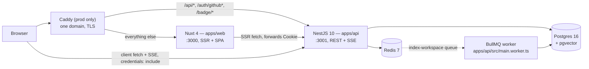

# Frontend architecture

A guided tour of the non-trivial frontend pieces — what they do, where they live, why they're shaped the way they are.

Everything described here lives in [`apps/web/`](../apps/web/). The frontend is a pure SSR/SPA Nuxt app: it owns no database connection, no queue, no LLM key. Every piece of data on screen arrives over HTTP from the NestJS API in [`apps/api/`](../apps/api/).

## Stack

Nuxt 4 + Vue 3 Composition API + `<script setup>`. Tailwind 4 (via `@tailwindcss/vite`) for utilities, shadcn-nuxt + reka-ui for primitives, `lucide-vue-next` for icons. State lives in composables and `useState` — no Pinia, no Vuex.

Everything heavy is a lazy `import()`: `shiki` (syntax highlighting), `mermaid` (diagrams), `sigma` + `graphology` (neighbour graph). `d3-hierarchy` + `d3-scale-chromatic` power the treemap. Internationalisation is `@nuxtjs/i18n` 10 with the `no_prefix` strategy (same URL, cookie-driven locale); theming is `@nuxtjs/color-mode`, dark by default.

There are no frontend tests. `vitest` is configured only in `apps/api`; `apps/web` has ESLint (`pnpm --filter @repobuddy/web lint`) and `vue-tsc` typecheck, and that's the whole automated safety net here. Worth knowing before you refactor something in this directory.

## How the two apps connect



In development the two run on separate origins (`:3000` and `:3001`) with no proxy in front, so **every request needs an explicit base URL and `credentials: 'include'`** or the session cookie never travels. That is the entire job of [`useApi.ts`](../apps/web/app/composables/useApi.ts):

- `useApi()` — a `$fetch.create` wrapper with `baseURL: runtimeConfig.public.apiBaseUrl` (`API_BASE_URL`, default `http://localhost:3001`) and `credentials: 'include'`.
- `useApiFetch()` — the same defaults on top of Nuxt's `useFetch`, plus one extra: during SSR the request is issued by the Nuxt server, not the browser, so it forwards the incoming `Cookie` header via `useRequestHeaders(['cookie'])`. Without that, every server-rendered page would see an anonymous session.

Auth state is hydrated once at boot by [`plugins/auth.client.ts`](../apps/web/app/plugins/auth.client.ts) (client-only, so SSR is never blocked on the cross-origin API). [`middleware/auth.global.ts`](../apps/web/app/middleware/auth.global.ts) redirects to `/login` unless a page opts out with `definePageMeta({ auth: false })`; [`middleware/admin.ts`](../apps/web/app/middleware/admin.ts) additionally checks `/api/me/admin` before rendering `/admin`. The admin guard is UX only — the API enforces `AdminGuard` server-side regardless.

## Pages

| Route | File | Notes |
| --- | --- | --- |
| `/` | [`pages/index.vue`](../apps/web/app/pages/index.vue) | Dashboard for signed-in users (workspace list + "index a GitHub URL" form); renders [`LandingPage.vue`](../apps/web/app/components/LandingPage.vue) for guests, which lists public workspaces from `/api/workspaces/public`. |
| `/login` | [`pages/login.vue`](../apps/web/app/pages/login.vue) | Single GitHub OAuth button. Points at `{API}/auth/github` — that route lives outside the `/api` prefix so the GitHub App's callback URL stays stable. |
| `/settings` | [`pages/settings.vue`](../apps/web/app/pages/settings.vue) | BYOK form: `baseUrl` / `model` / `embeddingModel` / `apiKey`, backed by `GET`+`PUT /api/me/byok`. An empty `apiKey` field means "leave the stored key alone" — the key is never sent back to the browser. |
| `/admin` | [`pages/admin.vue`](../apps/web/app/pages/admin.vue) | Users, audit log, workspaces with LLM cost, bulk delete. |
| `/w/[id]` | [`pages/w/[id]/index.vue`](../apps/web/app/pages/w/[id]/index.vue) | The main surface: indexing progress, chat, side panels, honest coverage signals, contributor invite. ~880 lines and the single biggest file in the app. |
| `/w/[id]/explore` | [`pages/w/[id]/explore.vue`](../apps/web/app/pages/w/[id]/explore.vue) | Treemap + neighbour graph. |
| `/w/[id]/graph` | [`pages/w/[id]/graph.vue`](../apps/web/app/pages/w/[id]/graph.vue) | 23 lines: a 308 redirect to `/explore`. The old global Sigma graph is gone; the route survives so external links and sitemap entries don't 404. |

`/w/[id]` and `/w/[id]/explore` both set `auth: false` — the server decides whether a workspace is publicly readable, and guests are a first-class audience (that's the point of the README badge).

## App shell

[`layouts/default.vue`](../apps/web/app/layouts/default.vue) is a viewport-locked column:

```html
<div class="flex h-screen flex-col bg-background overflow-hidden">
  <header>…</header>
  <main class="flex flex-1 flex-col min-h-0 overflow-y-auto
               [&:has(.cg-no-scroll)]:overflow-hidden">
    <div class="container mx-auto …">
      <slot />
    </div>
  </main>
</div>
```

Two non-obvious bits:

1. **`overflow-y-auto` on `main`, not on the inner container.** The vertical scrollbar sits at the right edge of the window, not inside the centred `container mx-auto`. The container that limits width is a child of the scroll host, not the scroll host itself.

2. **`[&:has(.cg-no-scroll)]:overflow-hidden` opt-out.** Pages whose root carries `class="cg-no-scroll"` (the workspace page, explore) want a viewport-locked layout with their own internal scrollers. The `:has()` selector lets them opt out of the page-level scroll without prop-drilling a `pageScrolls` flag through the layout.

The header also carries the quota pill (`messages` / `tokens` used-vs-limit from `/api/me/quota`). It refreshes on login state changes and on a shared `useState<number>('quota-bump')` counter that `useChat` increments after every completed turn — so the numbers move without a manual reload. Users whose quota is bypassed (admins, BYOK) get no pill at all rather than a meaningless `0/0`.

## Chat composable

[`composables/useChat.ts`](../apps/web/app/composables/useChat.ts) is the single source of truth for chat state: messages, streaming flag, session id, abort handle, history load, session switching. It persists one thing in `localStorage` — the session id per workspace, keyed `repobuddy:session:<workspaceId>` — so a reload lands you back in the same conversation.

There is no pin/focus API. An earlier iteration let you pre-pin entity/file/issue ids into every turn; it was removed on both sides, and neither the composable nor the server accepts such a field anymore.

`send()` POSTs to `/api/chat/:sessionId` with the body the API validates via `ChatBodySchema` ([`apps/api/src/modules/chat/chat.types.ts`](../apps/api/src/modules/chat/chat.types.ts)): `{ question (≤2000 chars), workspaceId, locale?: 'en' | 'ru', mode?: 'planned' | 'agentic' }`. `locale` is just `i18n.locale.value` — the server routes it to `OperatorContext.responseLocale` so the answer comes back in the UI language. `mode` comes from the Auto-explore checkbox.

### SSE handling

The response is a raw `fetch` stream (not `EventSource` — that can't POST and can't send a JSON body). The read loop is deliberately plain:

```ts
buffer += decoder.decode(value, { stream: true })
let idx: number
while ((idx = buffer.indexOf('\n\n')) !== -1) {
  const raw = buffer.slice(0, idx)
  buffer = buffer.slice(idx + 2)
  handleSseChunk(raw)
}
```

Splitting the *frame* is the easy half. Splitting the *fields* is where it went wrong once, so that part lives in a shared, unit-tested pure function: [`packages/shared/src/lib/sse.ts`](../packages/shared/src/lib/sse.ts) (`parseSseEvent`), covered by `apps/api/test/unit/sse-parser.test.ts`.

The rule that matters: a payload containing newlines is serialised as **multiple `data:` lines**, and per spec the data buffer joins them with exactly one `\n` and strips exactly one leading `U+0020 SPACE` (the field separator) from each. A naïve "concatenate the lines" collapses a Markdown heading into the paragraph after it — `"### Heading:- item1- item2"` was the actual symptom. This is a property of SSE itself, not of any particular server; it applied when the backend was Nitro and it applies now that `@Sse()` on NestJS emits the same wire format.

Events `handleSseChunk` understands:

| Event | Effect |
| --- | --- |
| `text` | Appended to the streaming assistant message. |
| `plan` | Parsed into `message.plan` — the planner's step list. |
| `trace` | Parsed into `message.trace` — the canonical, persisted execution record. |
| `tool_step` | Accumulated into a live `{ mode: 'agentic', steps: [] }` trace so the Reasoning Inspector updates as the model works. Both modes emit it: agentic streams every dispatch, planned emits it for the surfaced operators. The final `trace` event overwrites this with the authoritative copy. |
| `citations` | `{ citations, invalid }` — which `[chunk:…]` / `[entity:…]` ids resolved and which didn't. |
| `done` | Clears `pending`, bumps the shared quota counter. |
| `error` | Appends an italic error note and clears `pending`. |

`cancel()` aborts the in-flight `AbortController`; `send()`'s catch distinguishes an `AbortError` (mark the message `aborted`, substitute `_(stopped by user)_` if nothing streamed yet) from a real failure.

`extractResolution(trace)` is exported from the same file: it walks a trace newest-first, planned or agentic, and returns the most recent `find_resolution` envelope whose `status` isn't `'none'`. Because the planned-mode executor attaches full results for the operators on its surfaced-to-UI whitelist, this works when a session is reopened from the database too — not just live.

## Chat message rendering

[`components/ChatMessage.vue`](../apps/web/app/components/ChatMessage.vue) takes a streamed Markdown string and produces:

1. Citation badges — `[chunk:UUID]` / `[entity:UUID]` markers from the LLM become anchors (`<a class="cg-cite" data-kind data-id>`) that emit `open-chunk` / `open-entity` to the parent. Ids the server reported as `invalid` render with a `⚠` glyph and destructive tint instead of a working link. The glyph is real text content, not a CSS `::before`: `v-html`-injected nodes don't carry Vue's scoped-style attribute, and an anchor with no rendered content has no clickable hit area.
2. The Markdown is rendered with `marked`, sanitised with `DOMPurify`, mounted via `v-html`.
3. Two DOM post-processors run, both lazy-loaded on first use.

### Mermaid blocks

Walked by `querySelectorAll('pre code.language-mermaid')`. For each:

- Lazy `import('mermaid')` on the first block ever, memoised in a module-level promise — paid once per app session.
- Initialised with `theme: 'neutral'`, `securityLevel: 'strict'`.
- Render via `mermaid.render(uid, source)` to SVG.
- Sanitise the SVG with `DOMPurify` using the SVG profile. Mermaid's output is generated, but the source text came from an LLM — never trust it raw.
- Replace the `<pre>` with a `<div class="cg-mermaid">` wrapper; `data-mermaid-rendered="1"` prevents re-rendering on the next content tick.
- A render failure marks the block `error` and appends a one-line note rather than silently dropping the diagram.

### Code blocks (every other language)

Walked by `querySelectorAll('pre > code[class*="language-"]')`, skipping mermaid:

- Lazy `import('shiki')` on first call.
- Map the fence language (`ts`, `bash`, `yml`, `dockerfile`, `diff`, …) to a Shiki grammar through `SHIKI_LANG_ALIAS`; anything unknown falls back to `plaintext` instead of throwing.
- `codeToHtml(source, { lang, themes: { light: 'github-light', dark: 'github-dark' }, defaultColor: false })`.
- Sanitise with `ADD_ATTR: ['style', 'class']` so Shiki's inline CSS-variable styles survive.
- Replace the `<pre>`, tag it `data-shiki-highlighted="1"`.

### Dual-theme via CSS variables

Shiki's single-theme output bakes token colours as inline `style="color: #X; background-color: #Y"`. After a theme toggle those inline styles are stuck — a white `pre` background sitting on a dark surface. Dual-theme with `defaultColor: false` emits CSS variables on every span instead:

```html
<span style="--shiki-light: #008; --shiki-dark: #88f;">...</span>
```

A global rule in [`assets/css/tailwind.css`](../apps/web/app/assets/css/tailwind.css) maps them:

```css
.shiki, .shiki span {
  color: var(--shiki-light);
  background-color: var(--shiki-light-bg);
}
.dark .shiki, .dark .shiki span {
  color: var(--shiki-dark);
  background-color: var(--shiki-dark-bg);
}
```

`.dark` is the class `@nuxtjs/color-mode` puts on `<html>` (`classSuffix: ''`, preference and fallback both `dark`). Theme switching is therefore pure CSS — no re-render, no flash, no lag. Mermaid's `neutral` theme reads acceptably on both, so it doesn't need the same trick.

## Reasoning Inspector

[`components/ReasoningInspector.vue`](../apps/web/app/components/ReasoningInspector.vue) renders the assistant's plan + trace. Two modes share one component, discriminated by a computed that returns the envelope only when `trace.mode === 'agentic'`.

### Planned mode — SVG flowchart

Input: `plan.steps[]` (planner) + `TraceEntry[]` (executor).

1. For each step, regex the `$sN` references out of `step.params` to find its inputs (top-level values only — that's where the plan schema puts them).
2. Assign levels: a node sits one level deeper than the max level of its references.
3. Lay out as a grid — `STEP_W 180`, `STEP_H 56`, `ROW_GAP 18`, `COL_GAP 60`, `PAD 16` — levels as columns, steps stacked vertically inside a level.
4. Edges are SVG `path` elements with cubic bezier control points.
5. Node fill by outcome from the trace: ok / error / the streaming `answer` step / pending.
6. Click a node → a details box shows params (collapsible JSON), result summary and error.

The list-mode toggle renders the same data as a vertical accordion, sharing the `expanded` ref.

### Agentic mode — timeline

The agentic trace is `{ mode: 'agentic', steps: [{ iteration, name, args, summary, durationMs, error? }] }`. The component groups steps by iteration (a single round-trip can dispatch several parallel tool calls) and renders each as a row with a status pill, a tinted operator badge and click-to-expand JSON. The flowchart/list toggle is hidden — there's no DAG, just a sequence.

The badge tint comes from `OP_FAMILY`, which maps each of the 14 non-`answer` operators to one of six families (lookup / traversal / search / retrieve / analysis / external) and each family to a Tailwind class triple. `answer` never appears because it's the streaming terminal step, not a tool. If you add an operator and forget this map, the badge falls back to a neutral `other` tint — it degrades, it doesn't break.

## Side panels and the mobile split

[`components/SidePanelStack.vue`](../apps/web/app/components/SidePanelStack.vue) is a stateless tab container for the three chat side panels: **Reasoning Inspector / Source / Neighbours**. It owns no state — the workspace page holds the active panel plus the entity/chunk ids and passes them down.

The panel that opens by default is **Source**, not the Reasoning Inspector. Showing a newcomer where an answer came from is worth more than showing them how the engine planned it; the inspector is one tab away for anyone who wants it.

The same component renders in two places:

- **≥ lg** — a fixed 560px side column next to the chat.
- **< lg** — inside [`components/BottomSheet.vue`](../apps/web/app/components/BottomSheet.vue), a `Teleport`-to-`<body>` sheet that locks page scroll, closes on Esc and backdrop click, and slides up with a transform transition. Teleporting matters: a parent with `backdrop-filter` creates a containing block that would otherwise trap a `position: fixed` child.

The breakpoint itself comes from [`composables/useIsMobile.ts`](../apps/web/app/composables/useIsMobile.ts) — a `matchMedia('(max-width: 1023px)')` ref, defaulting to Tailwind's `lg`. `BottomSheet` deliberately does *not* check the viewport itself; the parent passes `:open="isMobile && …"`. That keeps the sheet a dumb presentational shell and the breakpoint decision in exactly one place.

Two mobile-specific behaviours follow from this:

- On a phone, keeping the default Source panel open would cover the chat on load, so a watcher clears `sidePanel` when the viewport is known to be mobile *and* nothing has been cited yet.
- The chat-history sidebar ([`ChatSessionsList.vue`](../apps/web/app/components/ChatSessionsList.vue)) is `hidden lg:flex`. Below `lg`, "new chat" and a history button live in the chat header instead, and the history opens in its own `BottomSheet`.

The treemap has its own mobile path: see below.

## Honest signals on the workspace page

Three surfaces on [`pages/w/[id]/index.vue`](../apps/web/app/pages/w/[id]/index.vue) exist to keep the product from overstating what it knows.

**Index freshness.** Once the workspace is ready, the page lazily calls `/api/workspaces/:id/freshness` and gets `{ indexedSha, headSha, behindBy }`. `behindBy === 0` renders a quiet neutral pill with the short sha; `behindBy > 0` renders an amber pill — clickable for the owner (it triggers re-index) and a plain read-only span for everyone else, with a different tooltip so a guest isn't told to press a button they don't have. The index is a snapshot: nothing refreshes it automatically, and the badge is the only place that says so.

**Coverage notices.** `workspaces.stats` carries flags written by the indexing pipeline, and the page turns three of them into quiet banners:

| Condition | What it tells the reader |
| --- | --- |
| `entities === 0` | Nothing was parsed into the graph — the repo's languages have no AST parser here (only TS/JS/Vue, Python, Go), so answers will lean on plain-text search. Rendered as a warning. |
| `filesTruncated === 1` | `MAX_FILES_PER_INDEX` was hit; the index covers part of the repository, not all of it. |
| `annotationBudgetHit === 1` | The per-index LLM budget stopped the annotation phase early, so some entities have no description. |

None of these fail the workspace — the index is still usable, and the banner says which corner is missing rather than pretending it isn't.

**Contributor invite.** For an owner viewing a *public*, *ready* workspace, a card renders the README badge snippet with a copy button and a live preview of the SVG:

```
[](<APP_URL>/w/<workspaceId>)
```

The two URLs come from different runtime config values on purpose. `/badge/*` is served by the API (it sits outside the `/api` prefix only so the URL stays short), so it's built from `apiBaseUrl`; the workspace page is a Nuxt route, so it's built from `appUrl`. Behind Caddy in production they collapse to one domain, but in the documented local setup (`:3000` / `:3001`) hard-coding either one would render a broken image or copy a dead link. If the clipboard write fails — insecure origin, browser policy — a toast says so rather than leaving the button inert.

The card is owner-only and public-only. An owner keeping a workspace private already made that choice; the "make it public first" hint lives on the visibility button's tooltip instead of nagging on every visit.

## Onboarding

There is exactly one onboarding surface: [`components/WorkspaceOnboarding.vue`](../apps/web/app/components/WorkspaceOnboarding.vue), a modal over the workspace page. (An earlier build shipped a second, separate overlay; it's gone.)

- Opens automatically the first time a user lands on a *ready* workspace. The seen flag is `localStorage['cg-onb-seen-<workspaceId>']`, written when the modal closes — per workspace, per browser.
- Reopens on demand via the **Tour** button in the workspace header.
- Esc and backdrop click close it.

It fetches in two waves. `useApiFetch` on `/api/workspaces/:id/onboarding` supplies entrypoints, core abstractions and good-first-PR zones. Two more calls fire on mount and degrade independently: `/setup-guide` (cheap, database-only — install/env/run/test/docker steps reconstructed from manifests and the README) and `/github-issues` (Octokit, so it can be slow or rate-limited; the payload carries a `reason` field — `rate_limited`, `not_github`, `repo_not_found`, `fetch_failed` — and the UI prints the specific cause instead of an empty list).

Each section hands off to the parent via `walkthrough` / `open-entity` / `ask`. The workspace page wires those into chat: `walkthrough` prefills "Walk me through {name} step by step" and submits, `open-entity` opens the Neighbour Graph panel, `ask` prefills a question template (for an issue it appends a hint pointing at the linked entity).

## Chat resolution banner

[`components/ChatResolutionBanner.vue`](../apps/web/app/components/ChatResolutionBanner.vue) renders the `find_resolution` envelope above the assistant's prose — the framing before the explanation. Status drives both the copy and a colour: `merged` (emerald), `open_pr` (sky), `draft_pr` (fuchsia), `stale_pr` (amber), `duplicate_closed` (violet), `related` (slate). `none` renders nothing at all.

The component picks one primary item to headline — newest fixing commit, the relevant PR, or the top-similarity duplicate — and gives it a single "view on GitHub" CTA. Everything else in the envelope stays in the Reasoning Inspector; this surface is intentionally one line of framing, not a data dump.

Because `find_resolution` now runs in the default **planned** mode too (not only in agentic), and the executor attaches its full result to the persisted trace, the banner reappears when a session is reopened days later.

Note the palettes are written as literal Tailwind class strings in a per-tone object. Tailwind scans source text, so interpolated fragments like `` `bg-${tone}-500/8` `` would be purged out of the build.

## Explore: treemap and neighbour graph

[`pages/w/[id]/explore.vue`](../apps/web/app/pages/w/[id]/explore.vue) is the canonical "what's in this repo" view, and it replaced the old whole-repo Sigma graph, which was unreadable past a few hundred nodes.

[`components/WorkspaceTreemap.vue`](../apps/web/app/components/WorkspaceTreemap.vue) — `d3-hierarchy`'s `treemap`, rendered as plain SVG rects. Rectangle size is always the file's entity count; the preset changes the fill:

- **loc** — monochrome ramp on entity count. What's big?
- **hotness** — `interpolateOrRd` over `metadata.hotness` (commits touching the file), clamped to 0..20. What's churning?
- **coverage** — green if the file has an inbound `tested_by` edge, red otherwise. What isn't tested?

A `ResizeObserver` re-lays-out on container resize, and labels are only drawn on rects wide/tall enough to hold them. Hover shows a tooltip with path, entity count, hotness and tested/untested.

Clicking a rect diverges by viewport, and this is the honest part: on desktop it emits `focus(entityId)` and the parent opens the neighbour graph beside the map (`≥ lg`, 480px). On mobile there is no room for that panel, so the tap opens a `BottomSheet` with the file's path and metrics plus a note saying the graph view is desktop-only. A dead tap would have been the alternative.

[`components/EntityNeighbourGraph.vue`](../apps/web/app/components/EntityNeighbourGraph.vue) — `sigma` + `graphology`, both lazily imported, centred on one entity at 1- or 2-hop depth via `/api/workspaces/:id/entity/:entityId/neighbours`. The layout is concentric and deterministic: focus at the origin, depth-1 on an 80px ring, depth-2 at 160px, nodes spread evenly around each ring — revisiting a node shows the same scene, which force-directed layouts can't promise. Node colour is by entity type, edge colour by relation type, both from small palettes picked at mid-lightness so they survive the theme flip.

The same panel toggles into [`components/CallHierarchy.vue`](../apps/web/app/components/CallHierarchy.vue) (+ `CallHierarchyNode.vue`): a text-only, indented tree over the same endpoint, lazy-expanding one level at a time, with a mode selector for callers / callees / tests / parent. It's the accessible-and-mobile-friendly reading of the same data — Sigma needs a canvas and a pointer, a list doesn't.

It opens from three places: an `[entity:…]` citation in chat, a treemap click on `/explore`, and a focus jump from the call hierarchy itself.

## Chunk citation flow

When the model writes `[chunk:UUID]`, `ChatMessage.vue` turns it into an anchor; clicking emits `open-chunk(id)`; the page sets `openChunkId` and switches the side panel to Source, where [`components/SourceViewerDrawer.vue`](../apps/web/app/components/SourceViewerDrawer.vue) takes over:

1. Fetches `/api/workspaces/:id/chunk/:chunkId`.
2. **Diff → source auto-swap.** If the chunk is a per-commit diff (`metadata.kind === 'diff'`) and a code chunk exists for the same path, it fetches `/chunk-by-path?path=…&excludeId=…` and shows the source instead, remembering the diff id so a "Diff" button flips back. Citations almost always landed on a diff when the reader wanted to read the file.
3. Code chunks render through Shiki (same dual-theme setup as chat), with the language inferred from `metadata.language` and the filename extension chain, so `foo.config.ts` still highlights as TypeScript.
4. Markdown chunks go through `marked` + `DOMPurify` into a `.cg-prose` container.
5. Diff chunks use Shiki's `diff` grammar. They're stored with `source_type='doc'` (so they ride the tsvector index) but tagged `metadata.kind='diff'` — the renderer trusts the tag, not the column.

## Indexing progress

[`composables/useWorkspaceProgress.ts`](../apps/web/app/composables/useWorkspaceProgress.ts) polls `GET /api/workspaces/:id` once per second until the status reaches `ready` or `failed`, then stops. It guards against overlapping requests and swallows transient errors (the next tick retries).

This is worth flagging because it looks like a missed opportunity: the API *does* expose `GET /api/workspaces/:id/progress` as an SSE stream. The frontend doesn't use it — Nuxt's dev-mode Vite middleware buffers that response, so events never reached the browser in development. 1 Hz polling of an already-cheap endpoint behaves identically through every dev and prod proxy combination. Chat SSE, which cannot be polled, goes through raw `fetch` instead of the Nuxt data layer for the same underlying reason (and Caddy sets `flush_interval -1` on the API route in production so it isn't buffered there either).

When polling reports a terminal state the page refetches the workspace, which is what makes the coverage banners and freshness badge appear the moment indexing finishes.

## Cursor affordance

Small, but it made the whole UI feel inert: Tailwind 4's reset ships interactive elements with `cursor: default`, so every `<Button>`, `<a>` and `[role=button]` rendered with a text cursor. One global block in [`assets/css/tailwind.css`](../apps/web/app/assets/css/tailwind.css) restores the pointer for everything clickable and switches to `not-allowed` for disabled variants. Text inputs and textareas are deliberately excluded — the I-beam caret is the right affordance there.

## Bilingual UX

[`i18n/locales/en.json`](../apps/web/i18n/locales/en.json) and [`ru.json`](../apps/web/i18n/locales/ru.json) are the two locales, 487 lines and 361 leaf keys each, maintained in lockstep.

**The rule: every new user-facing string goes into both files, in the same commit.** There is no fallback chain configured — a key missing from `ru.json` renders as the literal key path (`workspace.coverage.noEntities`) on a Russian page. That's a visible bug, not a graceful degradation.

Checking parity is a one-liner, and worth running before you push a change that touches either file:

```bash
node -e "
const a=require('./apps/web/i18n/locales/en.json'), b=require('./apps/web/i18n/locales/ru.json');
const keys=(o,p='')=>Object.entries(o).flatMap(([k,v])=>
  v && typeof v==='object' && !Array.isArray(v) ? keys(v,p+k+'.') : [p+k]);
const A=keys(a), B=keys(b);
console.log('en', A.length, 'ru', B.length);
console.log('missing in ru:', A.filter(k=>!B.includes(k)));
console.log('missing in en:', B.filter(k=>!A.includes(k)));
"
```

Locale selection is cookie-driven (`repobuddy-i18n`) with `strategy: 'no_prefix'`, so the URL never changes — one canonical URL per page, which also keeps the sitemap and SEO metadata simple.

The chat answer is localised server-side, not client-side. `useChat` sends `locale`, the API puts it on `OperatorContext.responseLocale`, and both prompt paths carry EN and RU variants: [`apps/api/src/modules/kag/internals/operators/answer.ts`](../apps/api/src/modules/kag/internals/operators/answer.ts) for planned mode and [`apps/api/src/modules/kag/internals/agentic.ts`](../apps/api/src/modules/kag/internals/agentic.ts) for the tool-use loop. Adding a third UI locale therefore means touching both those files as well as the JSON.

## Files to read

- App shell + global CSS: [`apps/web/app/layouts/default.vue`](../apps/web/app/layouts/default.vue), [`apps/web/app/assets/css/tailwind.css`](../apps/web/app/assets/css/tailwind.css)
- Cross-origin API access: [`apps/web/app/composables/useApi.ts`](../apps/web/app/composables/useApi.ts)
- Chat state + SSE: [`apps/web/app/composables/useChat.ts`](../apps/web/app/composables/useChat.ts), [`packages/shared/src/lib/sse.ts`](../packages/shared/src/lib/sse.ts)
- Chat message rendering: [`apps/web/app/components/ChatMessage.vue`](../apps/web/app/components/ChatMessage.vue), [`apps/web/app/components/ChatResolutionBanner.vue`](../apps/web/app/components/ChatResolutionBanner.vue)
- Reasoning Inspector: [`apps/web/app/components/ReasoningInspector.vue`](../apps/web/app/components/ReasoningInspector.vue)
- Panels + responsive shell: [`apps/web/app/components/SidePanelStack.vue`](../apps/web/app/components/SidePanelStack.vue), [`apps/web/app/components/BottomSheet.vue`](../apps/web/app/components/BottomSheet.vue), [`apps/web/app/composables/useIsMobile.ts`](../apps/web/app/composables/useIsMobile.ts)
- Source Viewer: [`apps/web/app/components/SourceViewerDrawer.vue`](../apps/web/app/components/SourceViewerDrawer.vue)
- Graph views: [`apps/web/app/components/EntityNeighbourGraph.vue`](../apps/web/app/components/EntityNeighbourGraph.vue), [`apps/web/app/components/CallHierarchy.vue`](../apps/web/app/components/CallHierarchy.vue)
- Treemap: [`apps/web/app/components/WorkspaceTreemap.vue`](../apps/web/app/components/WorkspaceTreemap.vue)
- Onboarding: [`apps/web/app/components/WorkspaceOnboarding.vue`](../apps/web/app/components/WorkspaceOnboarding.vue)
- Git insights card: [`apps/web/app/components/GitInsightsCard.vue`](../apps/web/app/components/GitInsightsCard.vue)
- Landing: [`apps/web/app/components/LandingPage.vue`](../apps/web/app/components/LandingPage.vue)
- Pages: [`apps/web/app/pages/index.vue`](../apps/web/app/pages/index.vue), [`apps/web/app/pages/w/[id]/index.vue`](../apps/web/app/pages/w/[id]/index.vue), [`apps/web/app/pages/w/[id]/explore.vue`](../apps/web/app/pages/w/[id]/explore.vue)
- Nuxt config (i18n, color-mode, runtimeConfig): [`apps/web/nuxt.config.ts`](../apps/web/nuxt.config.ts)
