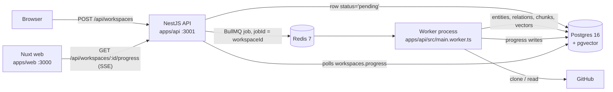

# Indexing pipeline

How a public GitHub URL becomes a queryable knowledge graph.

## Where the work runs

Creating a workspace and indexing it are two different processes. The HTTP API
([`apps/api/src/main.ts`](../apps/api/src/main.ts), NestJS 10 on Express) only
writes a row and enqueues a job; the actual pipeline runs in a standalone Nest
context ([`apps/api/src/main.worker.ts`](../apps/api/src/main.worker.ts)) that
boots `WorkerRootModule` without an HTTP server.



- Enqueue: [`workspaces.controller.ts`](../apps/api/src/modules/workspaces/workspaces.controller.ts)
  (`create`, and `reindex` for owner-triggered runs). The job id is the workspace
  id, so a second enqueue for the same workspace replaces rather than duplicates.
- Consume: [`index-workspace.processor.ts`](../apps/api/src/modules/workers/index-workspace.processor.ts),
  BullMQ concurrency from `WORKER_CONCURRENCY` (default 2).
- Cost gates and provider resolution: [`indexer.service.ts`](../apps/api/src/modules/indexer/indexer.service.ts).
- Orchestration: [`internals/pipeline.ts`](../apps/api/src/modules/indexer/internals/pipeline.ts) →
  `runIndexPipeline(db, job, deps)`.

Progress is written to `workspaces.progress` by
[`workspace-progress.ts`](../apps/api/src/modules/workspaces/workspace-progress.ts)
and streamed to the browser by
[`workspaces-progress.controller.ts`](../apps/api/src/modules/workspaces/workspaces-progress.controller.ts)
(`@Sse`, with `x-accel-buffering: no` so Caddy doesn't buffer it).

## Before the pipeline starts

`IndexerService.run` does three things the pipeline itself never sees, so that
the pipeline stays free of env coupling and stays testable:

1. Resolves providers with `tier: 'extraction'` — annotation runs on the cheap
   model (`OPENAI_MODEL_EXTRACTION`, default `gpt-4o-mini`), never on the
   planning model used by chat. A user's BYOK model always wins over the tier.
2. For server-paid runs (no BYOK), calls `assertWithinDailyBudget()` **before**
   enqueuing any work. If the service-wide daily cap is already spent, the
   workspace is marked `failed` with that message and the job returns
   `{ ok: false }` — it does not throw, so nothing retries against a closed gate.
   Admin logins (`ADMIN_LOGINS`) bypass.
3. Forwards `MAX_FILES_PER_INDEX`, `MAX_REPO_SIZE_MB` and — for non-BYOK users
   only — `LLM_BUDGET_USD_PER_INDEX` into `PipelineDeps`.

## The pipeline

```mermaid
flowchart TD
    A["1. load workspace row"] --> B["2. clone (depth 200, single branch)"]
    B --> C["2b. size gate: du -sk vs MAX_REPO_SIZE_MB"]
    C --> D["2c. persist indexedCommitSha + defaultBranch"]
    D --> E["3. walk tree (gitignore stack, maxFiles)"]
    E --> F["4. clearWorkspaceGraph — wipe previous graph"]
    F --> G["5. parse + AST chunk (concurrency 4)"]
    G --> H["5b. markdown chunks + document entities"]
    H --> I["5b'. manifest whole-file chunks"]
    I --> J["5b''. fallback whole-file chunks"]
    J --> K["5c. derive tested_by relations"]
    K --> L["6-8. persist entities, then relations"]
    L --> M["9. persist chunks + entity_chunks index"]
    M --> N["9b. embed chunks (batch 64)"]
    N --> O["9c. LLM annotation (concurrency 8, budget-capped)"]
    O --> P["9d. embed entity descriptions"]
    P --> Q["9e. concept/pattern dedup"]
    Q --> R["10. git history: commits, persons, diff chunks"]
    R --> S["10a. embed diff chunks · 10b. write file hotness"]
    S --> T["11. markWorkspaceReady + stats"]
    T --> U["11a. PR history (best effort)"]
    U --> V["11b. git insights merged into stats"]
```



### 1. Load the workspace row

A missing row throws immediately and the run is marked failed. Nothing else in
the pipeline reads the DB for configuration.

### 2. Clone

[`source/fetch.ts`](../apps/api/src/modules/indexer/internals/source/fetch.ts):
`simple-git clone --depth 200 --single-branch` into a `mkdtemp` directory named
`repobuddy-clone-*`. Only `sourceType='github'` is supported — anything else
throws `unsupported source type … only github implemented in phase 2`. A ZIP
extraction path (`extractZip`, `repobuddy-zip-*`) exists in the same file but is
not reachable from the pipeline.

`--depth 200` is the single most consequential knob here: history older than 200
commits, non-default branches and tags never enter the graph, and hotness is
computed over that truncated window.

### 2b. Repository size gate

If `deps.maxRepoSizeMb` is set (`MAX_REPO_SIZE_MB`, default 200), the pipeline
shells out to `du -sk` on the working directory — **git objects included** — and
throws `Repository too large: ~N MB on disk (incl. git history) exceeds the M MB
limit` when it is over. This is a rejection, not a truncation: the workspace goes
to `failed`. Note that the check runs *after* the clone, so the bandwidth and
wall-clock of cloning a large repo are spent either way.

### 2c. Record HEAD

`indexedCommitSha` and `defaultBranch` are written to `workspaces` here. Everything
the freshness endpoint later reports is anchored on this SHA.

### 3. Walk the tree

[`source/walk.ts`](../apps/api/src/modules/indexer/internals/source/walk.ts)
walks the working tree with a `.gitignore` stack (parent patterns inherited,
each directory's own `.gitignore` appended), plus:

- `HARD_EXCLUDES`: `.git`, `node_modules`, `.pnpm-store`, `dist`, `build`,
  `.next`, `.nuxt`, `.output`, `__pycache__`, `.venv`, `venv`, `vendor`,
  `.cache`, `.idea`, `.vscode`, `coverage`, `.turbo`
- `HARD_SUFFIX_EXCLUDES`: `.min.js`, `.min.css`, `.map`, `.lock`, `.bin`,
  `.exe`, `.dll`, `.so`, `.dylib`
- a hard 1 MB cap per file
- `maxFiles` — `MAX_FILES_PER_INDEX`, default 2000

Language detection is extension-based only
([`source/languages.ts`](../apps/api/src/modules/indexer/internals/source/languages.ts)):
`.ts/.tsx/.mts/.cts → typescript`, `.js/.jsx/.mjs/.cjs → javascript`,
`.vue → typescript` (SFC), `.py/.pyi → python`, `.go → go`. Everything else is
`language: null` and skips the AST step entirely.

`walkRepo` returns `{ files, languages, truncated }`, where `truncated` is true
when the walk stopped at `maxFiles`. The detected language list is written to
`workspaces.languages` right after.

### 4. Clear the previous graph

[`persist.ts:clearWorkspaceGraph`](../apps/api/src/modules/indexer/internals/persist.ts)
deletes the workspace's `relations`, `entity_chunks`, `chunks` and `entities` —
in that order — before anything new is written. Re-indexing is *throw away and
rebuild*, not reconciliation. That is deliberate: reconciling a graph whose
node identities are derived from line ranges costs more code and more failure
modes than a rebuild that finishes in minutes.

Consequence worth knowing: from this point until step 11, a re-indexed workspace
has an empty or partial graph. There is no shadow-build-then-swap.

### 5. Parse and chunk

Four workers (`CONCURRENCY = 4`) pull from a shared cursor over the parsable
files. Each worker reads the file, runs the parser for its language, and chunks
the result in the same pass:

| Language | Parser | Backend |
| --- | --- | --- |
| TypeScript / JavaScript / `.vue` | [`parsers/typescript.ts`](../apps/api/src/modules/indexer/internals/parsers/typescript.ts) | `ts-morph` |
| Python | [`parsers/python.ts`](../apps/api/src/modules/indexer/internals/parsers/python.ts) | `web-tree-sitter` + WASM grammar |
| Go | [`parsers/go.ts`](../apps/api/src/modules/indexer/internals/parsers/go.ts) | `web-tree-sitter` + WASM grammar |

Anything else is skipped — no Java, Rust, C#, C/C++, Ruby or PHP entities exist
in the graph. Those files still reach the chunk store via step 5b'' and are
findable by search; they just have no nodes or edges.

Parsers return `{ entities, relations, warnings }`. Entity types come from a
fixed union in [`packages/shared/src/types/index.ts`](../packages/shared/src/types/index.ts)
(`file`, `module`, `class`, `function`, `type`, `variable`, `component`, `route`,
`test`, `concept`, `pattern`, `decision`, `commit`, `pull_request`, `person`,
`document`), as do relation types (`imports`, `calls`, `extends`, `implements`,
`uses_type`, `defined_in`, `contained_in`, `renders`, `handles`, `tested_by`,
`implements_concept`, `follows_pattern`).

A parse error on one file does not abort the run — the message is appended to
`warnings` and the worker moves on.

Chunking ([`chunking/chunker.ts`](../apps/api/src/modules/indexer/internals/chunking/chunker.ts)):

- file with no non-`file` entities, or ≤ 150 lines → one whole-file chunk
- otherwise one chunk per top-level entity (parent is the file, or no parent),
  skipping entities shorter than 4 lines
- an entity longer than 200 lines is split at its children (methods); if it has
  no children it stays whole
- any chunk under `examples/`, `example/`, `samples/`, `sample/`, `demo/`,
  `demos/`, `sandbox/`, `playground/` gets `sourceType: 'example'`

If `walked.truncated` was set, step 5 also pushes the warning
`File cap reached (N files): the index covers only part of the repository`.

### 5b. Markdown

Every `.md`/`.mdx` file is split at H1–H3 headings by `chunkMarkdown`
(`sourceType: 'doc'`, or `'example'` under an examples path) and additionally
gets one `document` entity per file. Docs have no real language, so the entity
carries `typescript` as a sentinel value.

### 5b'. Manifests

`package.json`, `pyproject.toml`, `Makefile`, `Dockerfile`, `go.mod`,
`Cargo.toml`, `docker-compose*.yml` are stored as whole-file chunks with
`sourceType: 'config'`, capped at 256 KB each. Without this the onboarding and
setup-guide endpoints have nothing to read `pkg.scripts` or Makefile targets from.

### 5b''. Fallback whole-file chunks

Everything text-shaped under 128 KB that the previous passes missed —
`tsconfig.json`, YAML, TOML, SQL, CSS, shell scripts, extensionless files. The
skip regex drops AST-parseable extensions (already chunked) and obviously binary
ones, and a cheap sniff drops any file where fewer than 90% of the first 4 KB are
printable characters. `sourceType: 'code'`.

This pass is why `read_file({ path: 'tsconfig.json' })` returns something in chat.

### 5c. Derive `tested_by`

`deriveTestedByRelations` in [`pipeline.ts`](../apps/api/src/modules/indexer/internals/pipeline.ts)
walks every `imports` edge whose source is a `test` entity and emits a
`tested_by` edge from each top-level entity of the imported module back to the
test file. Resolution is path-based (trying `.ts/.tsx/.js/.jsx/.mts/.cts` and
`/index.*`), not symbol-based — "this test imports module X" is treated as "this
test exercises the top-level entities of X". It is a heuristic, and the
`tests_for` operator inherits its precision.

### 6–8. Persist entities and relations

[`persist.ts`](../apps/api/src/modules/indexer/internals/persist.ts):

- `insertEntities` dedupes by `qualifiedName` in memory first (Postgres rejects
  an `ON CONFLICT DO UPDATE` that touches the same conflict target twice in one
  statement — declaration merging and namespace re-opens both cause that), then
  inserts in batches of 500 with `ON CONFLICT (workspace_id, qualified_name) DO
  UPDATE`. Returns a `qualifiedName → uuid` map.
- The pipeline then builds a short-name index (`name.toLowerCase() → id[]`) so
  cross-file call targets can resolve when the qualified name doesn't match.
- `insertRelations` resolves each edge against the id map, then the extension /
  `index.*` variants, then the short-name index. Unresolvable edges are dropped
  rather than stored as dangling. Batches of 500.

### 9. Chunks and the mutual index

`insertChunks` writes in batches of 200 and returns both the id list and a
`qualifiedName → chunkId[]` map. `linkEntityChunks` turns that map into
`entity_chunks` rows (batches of 1000, `ON CONFLICT DO NOTHING`).

The link rule is exact: a chunk is linked to the entity whose `qualifiedName`
matches `chunk.metadata.qualifiedName`. Whole-file, manifest and fallback chunks
carry no `qualifiedName`, so they are searchable but not attached to an entity.

`entity_chunks` is what makes citations work in both directions — from
`[chunk:UUID]` back to its entity, and from `[entity:UUID]` to the code the
answer operator should quote.

### 9b. Chunk embeddings

[`embed.ts:embedChunks`](../apps/api/src/modules/indexer/internals/embed.ts)
selects the chunks that still have `embedding IS NULL`, then processes them in
batches of 64. The provider
([`providers/internals/embeddings.ts`](../apps/api/src/modules/providers/internals/embeddings.ts))
splits each batch further into API calls of up to 100 inputs, truncates any input
over 8000 tokens using the real `text-embedding-3-small` tokenizer, and retries
429/5xx with exponential backoff capped at 16 s. Vectors are written back one row
at a time — a single `UPDATE … FROM (VALUES …)` with parameterised pgvector
arrays is worse than it sounds in `postgres-js`.

Cost is recorded **once per pass**, not per batch: after the loop, `recordCost`
writes a single `llm_cost_log` row with the estimated total token count
(`sum(text.length / 4)`) and phase `embedding`. `embedChunks` neither reads nor
enforces any budget.

### 9c. LLM annotation

[`annotate.ts:annotateAndEmbed`](../apps/api/src/modules/indexer/internals/annotate.ts)
runs only when the caller passed an LLM and did not set `skipAnnotation`.

- **Candidates**: entities of type `class`, `function` or `module` spanning at
  least 8 lines. Nothing else is annotated.
- **Model**: the extraction tier resolved back in `IndexerService` —
  `gpt-4o-mini` class by default. This is the highest-call-count step in the
  whole system, which is exactly why it must not run on the planning model.
- **Requests are not batched**: one entity, one `structured()` call.
  `ANNOTATION_CONCURRENCY` workers (default 8) pull from a shared cursor.
- **Prompt**: up to 6000 characters of the entity's chunk text. When the parser
  extracted a JSDoc/docstring, it is passed separately as *author intent* so the
  model grounds on what the author wrote rather than re-inferring it.
- **Schema** (`SemanticAnnotationSchema`,
  [`packages/shared/src/schemas/annotation.ts`](../packages/shared/src/schemas/annotation.ts)):
  `{ description, concepts: [{ name, evidenceQuote }] (≤5), patterns: [{ name, confidence, evidenceQuote }] (≤5) }`.
  There is no top-level `confidence` and no `relations` field.
- **Writes**: `entities.description` on the annotated entity; `concept` /
  `pattern` entities created or reused via a `type::normalized-name` qualified
  name; `implements_concept` / `follows_pattern` edges carrying the evidence
  quote (and, for patterns, the model's confidence in metadata).
- A failure on one entity is logged and skipped; the run continues.

**Budget enforcement.** `LLM_BUDGET_USD_PER_INDEX` (default 2.0) arrives as
`options.budgetUsd` and becomes `budgetMicroCents`. Each worker checks
`spentMicroCents >= budgetMicroCents` at the top of every iteration and returns if so,
setting `budgetExhausted = true` and logging a warning with the counters. The
remaining entities are simply left without descriptions — the index still
reaches `ready`, `get_summary` just returns `null` for them. The flag surfaces as
`stats.annotationBudgetHit = 1` and, from there, as an honest coverage notice on
the workspace page.

There is no pre-flight estimator. The estimate accumulates as calls complete, so
the stop is always one iteration late by construction.

**How the estimate is computed — and why it matters.** `structured()` does not
return usage, so the code estimates `inputTokens = ceil(promptChars / 4)` and
`outputTokens = 200` (schema-bounded). Cents are then

converted to micro-cents by the single shared estimator in
[`lib/cost-log.ts`](../apps/api/src/lib/cost-log.ts):

```ts
// 1 cent = 10_000 micro-cents; tokens * centsPer1M / 1e6 cents == tokens * centsPer1M / 100 µ¢
export function estimateMicroCents(input): number {
  return (
    Math.round((inputTokens  * costCentsPer1MInput)  / 100) +
    Math.round((outputTokens * costCentsPer1MOutput) / 100)
  )
}
```

The unit matters. One annotation on the extraction tier costs about 0.04 cents,
so rounding each term **up to a whole cent** — which an earlier revision did —
put a 2-cent floor under every entity and exhausted the default `$2.00` budget
after roughly 100 of them. Rounding at micro-cent granularity keeps the error
below $5e-7 per call, so the budget now stops annotation at something close to
$2 of estimated spend rather than at an entity count wearing a dollar sign.

The same estimator feeds `llm_cost_log.usd_micro_cents`, the Redis daily
counter behind `COST_BUDGET_USD_PER_DAY`, and the Prometheus counter (which
stays denominated in cents, now fractional, so the Grafana panels are
unchanged). Unit coverage lives in
[`test/unit/cost-log.test.ts`](../apps/api/test/unit/cost-log.test.ts).

Prices themselves are hardcoded in
[`providers/internals/llm.ts`](../apps/api/src/modules/providers/internals/llm.ts):
a model name matching `/mini|haiku|small/i` is priced at 15¢ / 1M input and
60¢ / 1M output, anything else at 250¢ / 1000¢. Embeddings are 2¢ / 1M input.
These are OpenAI list prices; on Groq or a local Ollama the real bill is lower or
zero while the ledger keeps counting.

### 9d. Entity-description embeddings

`embedEntityDescriptions` embeds `entities.description` into `entities.embedding`
in batches of 64, skipping entities that already have a vector. These vectors are
used by concept/pattern dedup (next step) and by the closed-issue similarity
search inside `find_resolution`. This pass does **not** write a cost row.

Note that this is a second, separate embedding space from chunk embeddings. Chunk
vectors answer "where does this text appear"; description vectors answer "what
does this thing do". Mixing them would blunt both.

### 9e. Concept / pattern resolution

[`resolution.ts:resolveEntities`](../apps/api/src/modules/indexer/internals/resolution.ts)
deduplicates **`concept` and `pattern` entities only** — the LLM-generated ones.
Code entities are never merged; their identity is `(file, qualified name)` and is
already unique.

1. Group by `normalized_name`; keep the oldest, merge the rest.
2. For the survivors, compare description embeddings pairwise. `cosine ≥ 0.9`
   merges (`MERGE_THRESHOLD`); `0.75 ≤ cosine < 0.9` records the pair in
   `metadata.possibleDuplicates` without merging (`FLAG_THRESHOLD`).

Merging re-points incoming and outgoing edges to the canonical row, deletes
self-loops introduced by the merge, then deletes the duplicate. Without this,
"caching", "cache layer" and "Caching" all become separate hub nodes and the
concept layer turns into noise.

This step runs inside the same `if` as annotation — skip annotation and dedup is
skipped too.

### 10. Git history

[`git/history.ts:extractGitHistory`](../apps/api/src/modules/indexer/internals/git/history.ts)
reads up to 200 non-merge commits and, per commit, `git show --format= -U2` for
the diff. Per-file diffs are capped at 30 000 characters, the concatenated diff
at 60 000, with `diffTruncated` recorded when clipping happens.

[`persist.ts:persistGitHistory`](../apps/api/src/modules/indexer/internals/persist.ts)
writes:

- one `commit` entity per commit (`commit::<sha>`), with sha, author, date,
  message, files changed and the capped diff in metadata
- one `person` entity per unique `(name, email)`
- `authored` (person → commit) and `modified_by` (commit → file) edges
- one chunk per changed file per commit, carrying that file's unified diff.
  These ride `sourceType: 'doc'` with `metadata.kind: 'diff'` so they land in the
  existing tsvector index, and are linked to both the commit and (when known) the
  file entity.

### 10a–10b. Catch-up embeddings and hotness

Diff chunks are created after the main embedding pass, so
`embedAllPendingChunks` sweeps the workspace for any chunk still missing a
vector. Then `metadata.hotness` — the number of commits touching a file inside
the 90-day window — is written onto each `file` entity. Persisting it beats
recomputing: the treemap's hotness preset and the good-first-issue scoring both
read it directly.

### 11. Mark ready

`markWorkspaceReady` sets `status='ready'`, `lastIndexedAt`, and a `stats` object:

| Field | Meaning |
| --- | --- |
| `files`, `entities`, `relations`, `chunks`, `embeddedChunks`, `commits` | volume counters |
| `warnings` | count of warnings collected during the run (the messages themselves are not persisted) |
| `annotated`, `concepts`, `patterns` | annotation output |
| `mergedDuplicates`, `flaggedDuplicates` | resolution output |
| `tokensSpent` | always `0` — vestigial, real spend lives in `llm_cost_log` |
| `filesTruncated` | `1` when the walk hit `MAX_FILES_PER_INDEX` |
| `annotationBudgetHit` | `1` when annotation stopped on `LLM_BUDGET_USD_PER_INDEX` |

The last two are what the workspace page turns into coverage notices, so a
partially indexed repo says so instead of quietly pretending to be complete.

### 11a. PR history (best effort)

[`pr-history.ts:indexPullRequests`](../apps/api/src/modules/indexer/internals/pr-history.ts)
pulls up to 200 recently-updated closed PRs (two paginated Octokit calls), keeps
only the merged ones, and stores each as a `pull_request` entity (`pr::<number>`)
with `metadata.referencedIssues` extracted by regex from
`fixes|closes|resolves #N` in the body. `ON CONFLICT DO NOTHING` on `(workspace_id, qualified_name)`
keeps re-runs idempotent — which also means changed PR metadata is not refreshed
across re-indexes.

The whole step is wrapped in `try/catch`: GitHub being rate-limited or
unreachable logs a warning and leaves the index intact. `find_resolution` is the
operator that later reads `referencedIssues`.

Without `GITHUB_TOKEN` this runs anonymously at 60 requests/hour per IP; with a
read-only public-scope PAT it is 5000/hour.

### 11b. Git insights

[`git/insights.ts:computeGitInsights`](../apps/api/src/modules/indexer/internals/git/insights.ts)
aggregates `lastCommitAt`, `totalCommitsScanned`, `commitsLast30d`,
`commitsLast90d`, `activeMaintainers90d`, `topAuthors`, `busFactor`, `fixCount`,
`featCount`, `fixVsFeatRatio`, `breakingChangesLast90d` and
`commitFrequencyByMonth`, then merges them into `workspaces.stats` via jsonb
concatenation. This runs *after* `markWorkspaceReady` on purpose — that call
overwrites `stats` wholesale and would drop the insights if the order were
reversed.

All of it is computed over the 200-commit, single-branch window from step 2.
`busFactor` on a repo with 10 000 commits is a statement about the last 200.

## Concurrency and batch sizes at a glance

| Stage | Setting | Value |
| --- | --- | --- |
| Index jobs per worker process | `WORKER_CONCURRENCY` | 2 |
| BullMQ attempts | `defaultJobOptions.attempts` | **1** (no retries) |
| File parsing | `CONCURRENCY` in `pipeline.ts` | 4 |
| Entity insert | batch | 500 |
| Relation insert | batch | 500 |
| Chunk insert | batch | 200 |
| `entity_chunks` insert | batch | 1000 |
| Chunk embedding | DB batch / API batch | 64 / 100 |
| Embedding input truncation | tokens | 8000 |
| LLM annotation | `ANNOTATION_CONCURRENCY` | 8 |
| Annotation prompt | characters of code | 6000 |
| Git history | commits | 200 |
| PR history | PRs | 200 (2 API calls) |

## What actually gets embedded

Two vector spaces, both `text-embedding-3-small` at 1536 dimensions:

- `chunks.embedding` — every chunk: AST code chunks, whole-file chunks,
  manifests, markdown sections, and per-file commit diffs. This is what
  `hybrid_search` and `search_docs` query (pgvector cosine fused with Postgres
  `ts_rank` over a generated tsvector column, combined by RRF).
- `entities.embedding` — the LLM-written description only. Entities without a
  description have no vector, which for a budget-capped run is most of them.

## Cost and time in practice

Numbers below come from the code, not from production telemetry — the project is
not deployed, and there is no per-phase timing instrumentation beyond the job's
`durationMs`. Read them as arithmetic over the hardcoded prices and caps, and
treat the ledger and the real invoice as two different quantities.

**Small repository** (dozens of files, ~10 annotatable entities, a few hundred
chunks):

- ledger: ~10 entities × 2¢ floor ≈ **20¢** annotation, plus a couple of cents of
  embeddings → roughly **$0.20**
- real OpenAI billing on the same run: well under a cent
- the per-index budget is never approached

**Medium repository** (hundreds to a few thousand files, comfortably more than
100 annotatable entities):

- annotation hits `LLM_BUDGET_USD_PER_INDEX` and therefore books **exactly
  $2.00** in the ledger, having actually annotated ~100 entities
- chunk embeddings add single-digit cents (2¢ per 1M estimated tokens, recorded
  as one row per embedding pass)
- ledger total: **≈ $2.0x**
- real OpenAI billing: on the order of **$0.05–0.15** — ~100 annotation calls at
  roughly 1500 input + 200 output tokens on a `gpt-4o-mini`-class model is a few
  cents, and several million embedding tokens at $0.02/1M is a few more

**The operational consequence.** `COST_BUDGET_USD_PER_DAY` defaults to `3` and is
counted with the same inflated estimator. One medium-repo index therefore consumes
about two thirds of the daily cap, and a second one closes it: after that,
non-admin, non-BYOK users get a 503 from chat, from new indexing runs and from the
paid MCP tools until UTC midnight. If you intend to actually index several repos a
day, raise `COST_BUDGET_USD_PER_DAY` — the real spend is nowhere near it.

**Time.** No phase-level instrumentation exists. The only anchor in the codebase
is the comment in `annotate.ts`: at `ANNOTATION_CONCURRENCY=8`, a 500-entity run
takes about 2 minutes against roughly 15 sequential. A budget-capped ~100-entity
annotation is therefore on the order of half a minute, and the bulk of a real run
is spent in the clone, the 4-way parse and the embedding batches (which back off
on 429s). Measure your own repos with the `durationMs` in the job result before
quoting anything more precise.

## Failure handling and idempotency

The whole run sits inside **one** `try/catch` in `runIndexPipeline`, with two
local exceptions: per-file reads in the parse/markdown/manifest/fallback passes
swallow their own errors into `warnings`, and step 11a wraps PR history so GitHub
problems cannot fail an otherwise good index.

On any other error the catch block unwraps `err.cause` — `postgres-js` hides the
useful `PostgresError` fields (`code`, `detail`, `table_name`) there — logs them,
calls `markWorkspaceFailed(db, workspaceId, message)`, and rethrows. The SSE
progress stream carries the failure to the browser as `phase: 'failed'` with that
message. A `finally` block always removes the temp clone directory.

**Retries: there are none.** The queue is registered with `attempts: 1`
([`queues.module.ts`](../apps/api/src/modules/queues/queues.module.ts)), so a
failed index stays failed until the owner presses re-index. That is intentional
for a pipeline whose expensive step spends money — an automatic retry on a
repository that is too large, or on an LLM outage, would burn budget three times
to reach the same conclusion. Failed jobs are retained for 7 days, completed ones
for 24 hours.

**Idempotency** comes from three places:

- The BullMQ job id *is* the workspace id, so two enqueues for the same workspace
  cannot run as two jobs. `reindex` removes the old job before adding the new one,
  and rejects with 409 if the workspace is currently `cloning`/`parsing`/
  `extracting`/`embedding`.
- `clearWorkspaceGraph` wipes the previous graph at step 4, so a re-run never
  merges into stale state.
- Entities and PRs upsert on `(workspace_id, qualified_name)`, so even a partial
  re-run cannot produce duplicates.

A crash between step 4 and step 11 therefore leaves the workspace `failed` with an
empty or partial graph, and re-indexing is the recovery path. There is no resume.

## Index freshness

The index is a snapshot of one commit. Nothing re-indexes on its own.

- **`workspaces.indexedCommitSha`** is written at step 2c and is the anchor for
  everything below.
- **`GET /api/workspaces/:id/freshness`**
  ([`workspaces-query.service.ts:getFreshness`](../apps/api/src/modules/workspaces/workspaces-query.service.ts))
  returns `{ indexedSha, headSha, behindBy, checkedAt }`. It asks GitHub for the
  default branch's HEAD and then `compareCommits(base: indexedSha, head: headSha)`,
  reporting `ahead_by` as `behindBy`. The result is cached in Redis; a GitHub
  failure degrades to `behindBy: null` with a shorter cache TTL rather than an
  error.
- **The workspace page** renders that as either "up to date (`abc1234`)" or
  "N commits behind", with a hint that points the owner at the re-index button
  ([`apps/web/app/pages/w/[id]/index.vue`](../apps/web/app/pages/w/%5Bid%5D/index.vue)).
- **The README badge** (`GET /badge/<workspaceId>.svg`,
  [`badge.controller.ts`](../apps/api/src/modules/badge/badge.controller.ts))
  deliberately does **not** show freshness. It has exactly two states —
  "explore this repo" for a public workspace and a neutral "not found" otherwise
  — and stays in the first state even mid-reindex. Putting a commit count in a
  README image would make it change under the maintainer's feet on every upstream
  push; the number belongs on the page the badge links to.
- **Re-indexing is manual**: `POST /api/workspaces/:id/reindex`, owner only.
  There is no scheduler, no webhook, no background staleness sweep.

## Known limits

- AST parsing covers TypeScript, JavaScript, `.vue`, Python and Go. Every other
  language reaches the chunk store but never the graph.
- Even within supported languages, re-exports, generics resolution and dynamic
  imports are best-effort; `tested_by` is a path heuristic.
- `MAX_FILES_PER_INDEX` truncates by walk order, so a truncated index covers a
  prefix of the tree rather than a representative sample. `stats.filesTruncated`
  is the honest signal.
- `MAX_REPO_SIZE_MB` is checked after the clone, so an oversized repo costs a full
  clone before being rejected.
- The per-index budget stops annotation by an inflated estimate, so a medium repo
  gets descriptions for roughly its first hundred annotatable entities and `null`
  for the rest.
- `--depth 200 --single-branch` bounds history, hotness, bus factor and PR
  linkage alike.
- Only public GitHub repositories by URL. The ZIP path exists in `fetch.ts` but
  the pipeline rejects it.

## Files to read

- Orchestration — [`internals/pipeline.ts`](../apps/api/src/modules/indexer/internals/pipeline.ts)
- Cost gates and provider tier — [`indexer.service.ts`](../apps/api/src/modules/indexer/indexer.service.ts)
- Queue wiring — [`queues.module.ts`](../apps/api/src/modules/queues/queues.module.ts),
  [`index-workspace.processor.ts`](../apps/api/src/modules/workers/index-workspace.processor.ts)
- Fetch / walk — [`source/fetch.ts`](../apps/api/src/modules/indexer/internals/source/fetch.ts),
  [`source/walk.ts`](../apps/api/src/modules/indexer/internals/source/walk.ts),
  [`source/languages.ts`](../apps/api/src/modules/indexer/internals/source/languages.ts)
- Parsers — [`internals/parsers/`](../apps/api/src/modules/indexer/internals/parsers/)
- Chunker — [`chunking/chunker.ts`](../apps/api/src/modules/indexer/internals/chunking/chunker.ts)
- Persistence — [`internals/persist.ts`](../apps/api/src/modules/indexer/internals/persist.ts)
- Embeddings — [`internals/embed.ts`](../apps/api/src/modules/indexer/internals/embed.ts),
  [`providers/internals/embeddings.ts`](../apps/api/src/modules/providers/internals/embeddings.ts)
- Annotation — [`internals/annotate.ts`](../apps/api/src/modules/indexer/internals/annotate.ts),
  [`packages/shared/src/schemas/annotation.ts`](../packages/shared/src/schemas/annotation.ts)
- Concept dedup — [`internals/resolution.ts`](../apps/api/src/modules/indexer/internals/resolution.ts)
- Git — [`git/history.ts`](../apps/api/src/modules/indexer/internals/git/history.ts),
  [`git/insights.ts`](../apps/api/src/modules/indexer/internals/git/insights.ts)
- PR history — [`internals/pr-history.ts`](../apps/api/src/modules/indexer/internals/pr-history.ts)
- Progress and status — [`workspace-progress.ts`](../apps/api/src/modules/workspaces/workspace-progress.ts),
  [`workspaces-progress.controller.ts`](../apps/api/src/modules/workspaces/workspaces-progress.controller.ts)
- Cost ledger and daily gate — [`lib/cost-log.ts`](../apps/api/src/lib/cost-log.ts)
- End-to-end test on fixtures — [`test/integration/pipeline.test.ts`](../apps/api/test/integration/pipeline.test.ts)
