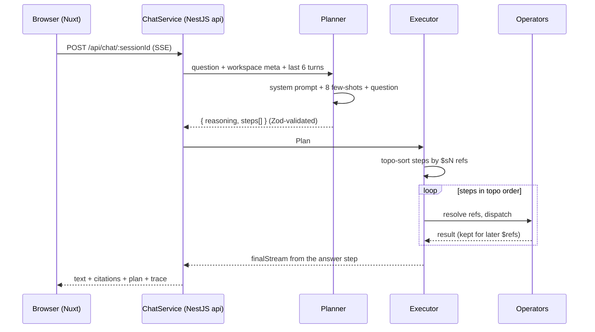
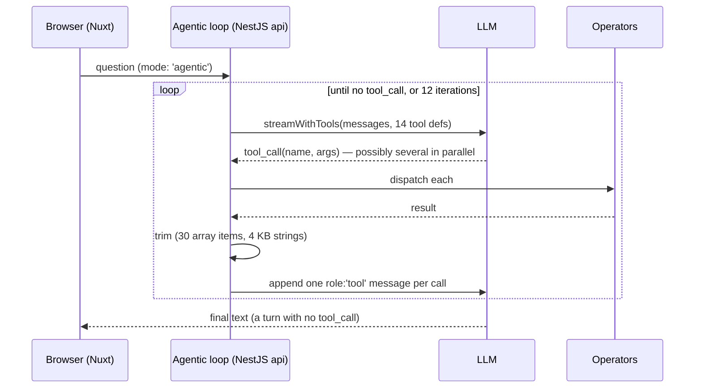

# KAG planning

This is what makes RepoBuddy not-just-RAG.

## The problem with plain RAG over code

A naïve "chat with your code" pipeline:

```
question → embed(question) → cosine-similar chunks → LLM(chunks + question) → answer
```

Works for **lexical** questions ("what does the README say about installation?"). Falls over on the questions a contributor actually has:

- _"Who calls processPayment, transitively, two hops deep?"_ — graph traversal; no embedding similarity will find it.
- _"List all the classes in this project."_ — enumeration over an entity type, not similarity over text.
- _"I want to work on issue #191 — where do I start?"_ — needs to check whether the issue is already fixed, fetch the issue body (not in any chunk), link it to the code it mentions, walk the call graph from there, and pull the source for the touched files.

## KAG = knowledge graph + planner

The indexer writes a typed knowledge graph (`entities` + `relations` + `chunks`, see [architecture](architecture.md)). On top of it sits a catalogue of **operators** that traverse that graph. An LLM planner picks which operators to call, in what order, with what params; a deterministic executor runs the plan; a final `answer` operator produces text grounded in the operator outputs.

### The 15-operator catalogue

`answer` is the sink — every plan must end with it. The other 14 are pure reads over the graph and never mutate it.

| Operator | Params (defaults) | What it does | Implementation |
| --- | --- | --- | --- |
| `find_symbol` | `name?`, `type?`, `fuzzy?`, `limit?` (20) | Entity lookup by name and/or type. With only `type` set it degenerates into enumeration ("list all classes"). | [`traversal.ts`](../apps/api/src/modules/kag/internals/operators/traversal.ts) |
| `get_callers` | `target`, `transitive?`, `maxDepth?` (5 when transitive), `limit?` (200) | Inbound `calls` edges. Transitive mode is a BFS over `relations`, not a text search. | `traversal.ts` |
| `get_callees` | `source`, `transitive?`, `maxDepth?`, `limit?` (200) | Outbound `calls` edges — mirror of `get_callers`, same traversal helper. | `traversal.ts` |
| `get_summary` | `entity` | Returns the LLM-written `entities.description` produced during indexing. Pure DB read, no LLM call at query time. | `traversal.ts` |
| `walkthrough` | `entity`, `limit?` (20) | Direct callees + covering tests + enclosing parent around one entity, plus a rendered mermaid sequence diagram of the call chain. | `traversal.ts` |
| `git_history` | `entity`, `since?`, `limit?` (50) | Commits that touched a file/entity, read from the indexed `modified_by` edges — not from a live `git log`. | [`git.ts`](../apps/api/src/modules/kag/internals/operators/git.ts) |
| `hybrid_search` | `query`, `limit?` (10) | pgvector cosine + Postgres `ts_rank`, fused with RRF, over **all** chunks (code, docs, diffs). | [`search.ts`](../apps/api/src/modules/kag/internals/operators/search.ts) → [`hybrid_search.ts`](../apps/api/src/modules/kag/internals/operators/hybrid_search.ts) |
| `search_docs` | `query`, `limit?` (12) | Same retrieval, restricted to markdown/doc chunks (READMEs, design notes, PR bodies). | `search.ts` |
| `retrieve_code_chunks` | `entities`, `limit?` (50) | Pulls source text for a set of entities through the `entity_chunks` join. | `search.ts` |
| `list_issues` | `issueNumber?`, `labels?`, `state?`, `limit?` (15, max 30) | Open GitHub issues for the workspace repo, already linked to indexed code (`relatedEntities` + `relatedChunks`). | [`github.ts`](../apps/api/src/modules/kag/internals/operators/github.ts) |
| `find_resolution` | `issueNumber` | Is this issue already solved? Scans indexed commits for `fix/close/resolve #N`, live-searches GitHub for PRs in any state (including drafts), and finds cosine-similar closed issues. Returns a status bucket: `merged \| open_pr \| draft_pr \| stale_pr \| duplicate_closed \| related \| none`. | `github.ts` |
| `get_project_overview` | — | Workspace snapshot: entrypoints, core abstractions, good-first issues, hot files, contribution guide, auto-generated architecture mermaid, entity-type stats. | [`insights.ts`](../apps/api/src/modules/kag/internals/operators/insights.ts) |
| `read_file` | `path`, `limit?` (6, max 20) | Verbatim file contents from chunks. Matches on exact path **or** path suffix, so `tsconfig.json` and `src/index.ts` both resolve. | `insights.ts` |
| `tests_for` | `entity`, `limit?` (20, max 50) | Tests covering an entity via the inferred `tested_by` relation — impact analysis for "what breaks if I change this". | `insights.ts` |
| `answer` | `question`, `context`, `style?` | The only streaming operator and the mandatory last step. Unpacks the other steps' envelopes and generates the reply with citations. | [`operators/index.ts`](../apps/api/src/modules/kag/internals/operators/index.ts) + [`answer.ts`](../apps/api/src/modules/kag/internals/operators/answer.ts) |

The single source of truth for operator names is [`packages/shared/src/schemas/plan.ts:OPERATOR_NAMES`](../packages/shared/src/schemas/plan.ts) — a `const` tuple that drives the Zod enum validating LLM-emitted plans, **and** types the `KAG_OPERATOR_CLASSES` registry, **and** types `TOOL_DEFS_MAP` in `agentic.ts` (a `Record<Exclude<OperatorName, 'answer'>, …>`, so a new operator is a compile error until it has a tool definition).

The one place TypeScript cannot reach is the prose catalogue inside the planner's system prompt — it is a string. [`apps/api/test/unit/planner-catalogue.test.ts`](../apps/api/test/unit/planner-catalogue.test.ts) closes that hole: for every name in `OPERATOR_NAMES` it asserts the name appears in `planner.ts`, and that every non-`answer` operator has a tool def in `agentic.ts`.

## Planned mode (default)



**Planning.** One `llm.structured()` call against the `planning` tier (default `gpt-4o`) with a system prompt that carries the operator catalogue, the `$sN` reference syntax, ~12 routing rules, and **8 few-shot plans** (symbol lookup, transitive callers, fuzzy search, walkthrough, enumeration, project overview, issue listing, single-issue resolution). The response is parsed against `PlanSchema`: `reasoning` plus 1–15 steps, each with an `s<N>` id, an operator from the enum, and a free-form `params` record.

**Failure ladder.** If validation fails, the planner retries once with the validation error appended as a user turn ("Your previous response failed validation: …"). If that also fails, it increments `repobuddy_planner_failures_total` and returns a deterministic fallback plan: `hybrid_search(question) → answer`. A degraded RAG answer beats an error page.

**History.** The last 6 user/assistant turns (600 chars each) are rendered into a "Recent conversation" block before the question, so follow-ups like "and the callers?" plan against the identifier from an earlier turn instead of against a fragment.

## How a plan executes

[`executor.ts`](../apps/api/src/modules/kag/internals/executor.ts) is deliberately boring — no LLM in the loop.

1. **Topo-sort.** Every step's `params` are walked for `$sN` occurrences to build a dependency set, then depth-first sorted. Cycles, references to unknown steps, and unknown operators all throw before anything runs. Steps without dependencies keep their authored order.
2. **Reference resolution.** `$s1`, `$s2.field`, `$s1.issues[0].relatedEntities` — a small path resolver applies `.field` and `[index]` segments to the stored result of the referenced step. Resolution is recursive through arrays and objects, so a ref can sit anywhere inside `params`.
3. **Dispatch.** The operator is fetched from `KagOperatorsRegistry.asLegacyMap()`. If the call returns an async generator (only `answer` does), it becomes `finalStream` and execution continues without draining it; otherwise the awaited result is stored under the step id for later refs.
4. **Instrumentation.** Each step pushes a trace entry (`stepId`, `op`, `ok`, `durationMs`, a compact `summary` like `array(12)` or `object{issues,relatedChunks}`) and increments `repobuddy_kag_operator_runs_total` / `repobuddy_kag_operator_latency_seconds`.
5. **Fail-fast.** A failing step records `ok: false` with the error, then throws `PlanExecutionError(stepId, op, cause)`. There is no partial answer: the chat SSE stream emits an `error` event naming the step and operator. The trade-off is deliberate — a half-executed plan produces an answer grounded in less context than the planner asked for, and there is no honest way to say so in the output.

Operators listed in `TOOL_RESULTS_SURFACED_TO_UI` (currently just `find_resolution`) also get their **full result envelope** attached to the trace entry, not only a summary. That is what lets the resolution banner survive a page reload — see [persistence](#persistence-and-the-reasoning-inspector).

## Agentic mode (the Auto-explore checkbox)



- No planner, no plan validation, no retry. The model owns control flow; the loop just dispatches and appends.
- **14 tools** — every operator except `answer`. The final answer is the model's own text turn once it stops calling tools.
- **`maxIterations` is 12** (`opts.maxIterations ?? 12` in [`agentic.ts`](../apps/api/src/modules/kag/internals/agentic.ts)), and the system prompt states the same budget to the model in both locales. Hitting the cap does not error: the loop appends a "tool-call budget exhausted, compose the best answer you can" system nudge and does one final tool-free streaming turn.
- Tool results are trimmed before re-entering the prompt (arrays capped at 30 items, strings at 4 KB) so one fat result cannot blow up every subsequent turn's input tokens.
- Several tool calls per iteration are normal — the model routinely fans out `read_file` across 2–4 paths in one round.
- Cost: materially more expensive per question than planned mode, because every iteration re-sends the whole growing message list. That is why it is opt-in behind a checkbox rather than the default.

## Worked example — "I want to work on issue #42"

### Planned mode

The routing rule and the matching few-shot both say the same thing: a plan about a specific issue **must start with `find_resolution`**. Six steps:

```json
{
  "reasoning": "Specific issue — check for an existing resolution FIRST (merged fix / in-flight PR / duplicate), then fetch the issue and expand the top relatedEntities (walkthrough + callers) so the answer can ground in real code, not just point back to GitHub.",
  "steps": [
    { "id": "s1", "op": "find_resolution", "params": { "issueNumber": 42 } },
    { "id": "s2", "op": "list_issues", "params": { "issueNumber": 42 } },
    { "id": "s3", "op": "walkthrough", "params": { "entity": "$s2.issues[0].relatedEntities", "limit": 8 } },
    { "id": "s4", "op": "get_callers", "params": { "target": "$s2.issues[0].relatedEntities", "transitive": false, "limit": 12 } },
    { "id": "s5", "op": "retrieve_code_chunks", "params": { "entities": "$s4" } },
    {
      "id": "s6",
      "op": "answer",
      "params": {
        "question": "I want to work on issue #42 — where do I start in the code?",
        "context": ["$s1", "$s2", "$s3", "$s4", "$s5"],
        "style": "detailed"
      }
    }
  ]
}
```

What the executor does with it:

1. `find_resolution({issueNumber: 42})` → a `ResolutionEnvelope` with `status`, `confidence`, `reason`, `mergedByCommits`, `linkedPullRequests`, `duplicateCandidates`. This step has no dependencies, so it runs first in authored order.
2. `list_issues({issueNumber: 42})` → `{ issues: [{ number, title, bodyExcerpt, relatedEntities, … }], relatedChunks }`.
3. `$s2.issues[0].relatedEntities` resolves to an array of entities → `walkthrough` returns `{ entities, mermaid }`.
4. The same ref feeds `get_callers`, giving the inbound-edge entities.
5. `$s4` (the callers array) → their code chunks via `entity_chunks`.
6. `answer` receives all five results as context and streams the reply.

Ordering note: `find_resolution` running first is a property of the *plan*, not of the executor. Steps with no `$sN` dependencies keep the order the planner emitted them in, which is why the planner prompt is explicit about putting it first.

### Agentic mode, same question

No pre-planning; each call is decided from the previous result:

```
iter 1  → find_resolution({issueNumber: 42})      → status "draft_pr", 1 linked PR
          list_issues({issueNumber: 42})          → 1 issue, 3 relatedEntities   (parallel)
iter 2  → read_file({path: "src/parser.ts"})      → 1 file, 4 chunks
          read_file({path: "test/parser.test.ts"})→ 1 file, 2 chunks             (parallel)
iter 3  → walkthrough({entity: <top related>})    → 5 entities, mermaid
iter 4  → tests_for({entity: <walkthrough[0]>})   → 0 entities  (no coverage)
iter 5  → (no tool call) → final answer streams
```

Lower latency on narrow lookups, but the loop can wander on vague questions. Planned mode is the more predictable of the two, and since `find_resolution` reaches the answer in both, agentic is no longer required to get resolution-aware behaviour.

## How the answer is assembled

`answerOp` in [`operators/index.ts`](../apps/api/src/modules/kag/internals/operators/index.ts) is the join point: the plan hands it a heterogeneous `context` array and it has to turn that into one prompt. It flattens the array (two levels deep) and classifies each object by shape:

| Envelope | Detected by | What is lifted out |
| --- | --- | --- |
| Project overview | `entrypoints` + `coreAbstractions` + `stats` together | Rendered as an "Orientation" prompt section; `coreAbstractions` are lifted into the entity context so they are citable. |
| Resolution | `status` + `issueNumber` + `mergedByCommits` + `linkedPullRequests` | Rendered as an "Issue #N resolution status" section (status, fixing commits, linked PRs, similar issues). Last one wins if the plan ran it twice. |
| Issues | `issues[]` whose items have a numeric `number` | Issues go into a dedicated prompt section; their `relatedEntities` / `relatedChunks` are lifted into the citation context. |
| Walkthrough | `entities[]` + string `mermaid` | The mermaid block is collected for verbatim inclusion; the inner entities are unwrapped. |
| Chunk | `text` + (`id` or `chunkId`) | Appended to the chunk list. `hybrid_search` returns `chunkId`; the others return `id` — both are accepted. |
| Entity | `id` + `name` + `type` | Appended to the entity list. |

Entity and chunk ids are de-duplicated across all envelopes, so an entity reached by three different steps is prompted once. Entities the user cited by hand (`[entity:UUID]` in the question) are seeded first, with their linked chunks, before anything from the plan.

Two behaviours worth knowing:

- **Safety net.** If the whole context yielded zero chunks, `answerOp` runs `hybrid_search` on the raw question itself (limit 8) before generating. A plan that retrieved only entities still produces a grounded answer instead of a vague one. Failures here are swallowed — the answer proceeds on workspace metadata alone.
- **The resolution section changes the shape of the reply.** When `status != 'none'`, the answer prompt tells the model to frame the reply around the existing fix ("already merged in `<sha>`, pull latest" / "draft PR #X is mid-flight — finishing it would be a good contribution") rather than re-investigating the bug. This is the behaviour that used to exist only in agentic mode.

### Citation discipline

The `answer` system prompt is strict about citation form:

- Code claims → `[chunk:UUID]` (resolves to the source-viewer drawer)
- Entity claims → `[entity:UUID]` (resolves to the neighbour graph)
- GitHub issues → `[#42](issue-url)` — never `[entity:42]` or `[chunk:42]` (a real early hallucination mode)

After the stream completes, [`chat.service.ts`](../apps/api/src/modules/chat/chat.service.ts) runs `extractCitations()` over the assembled text, checks every `[chunk:UUID]` against actual chunk rows in that workspace, and emits `{ citations, invalid }`. The frontend badges the invalid ones. The model is held to its citations rather than trusted on them.

## Persistence and the Reasoning Inspector

Every assistant turn writes `plan` and `trace` as JSONB on `chat_messages`. `GET /api/chat/:sessionId` returns them with the message history, so reopening a session restores the reasoning, not just the text.

[`ReasoningInspector.vue`](../apps/web/app/components/ReasoningInspector.vue) discriminates on the trace shape: a planned trace is an array of step entries; an agentic trace is `{ mode: 'agentic', steps }`. Planned traces render as an SVG flowchart (levels derived from the `$sN` edges) with a list fallback; agentic traces render as a timeline grouped by iteration, since there are no edges to draw.

The `find_resolution` envelope takes a second path to the UI. In agentic mode the loop yields it inside a `tool_step` event; in planned mode the chat service replays it as the *same* `tool_step` event from the trace entry that carries the full `result`. [`ChatResolutionBanner.vue`](../apps/web/app/components/ChatResolutionBanner.vue) therefore works identically in both modes, and because the envelope lives in the persisted trace, the banner re-hydrates on session reopen instead of vanishing.

## Why the catalogue went from 28 operators to 15

The first version of the catalogue had 28 operators. Cutting it to 15 removed roughly 1,260 lines and did not cost a single user-facing scenario. The reasons the cuts were possible are more interesting than the count.

**1. Duplicates of an operator that was already better.** `vector_search_chunks` was the pure-vector arm of the same retrieval that `hybrid_search` performs with RRF on top — strictly worse, and the planner had no principled way to choose between them. `find_by_concept` was semantic search over entity descriptions; `find_file` was `find_symbol({type:'file'})` wearing a hat, and `read_file`'s suffix matching covered the rest of its use. Every one of these gave the planner a fork with no good decision rule, which is a reliable way to get inconsistent plans for identical questions.

**2. Graph traversals that were one parameter apart.** `get_dependencies` / `get_dependents` walked `imports` edges through the same `traverse()` helper that `get_callers` / `get_callees` walk `calls` edges with; `find_implementations` did the same over `implements`. Four extra names for one code path. In practice the planner mixed up "who imports this" and "who calls this" often enough that the distinction cost more accuracy than it bought.

**3. Operators without a few-shot are close to dead code.** The system prompt lists every operator in prose, but the model's behaviour is dominated by the 8 few-shot plans. An operator that appears only in the catalogue prose and never in a demonstrated plan is essentially never emitted. `list_concepts` was the clearest case: it existed, it worked, and the planner had no example teaching it when to reach for it. The lesson is now a rule — an operator that does not earn a few-shot does not earn a slot.

**4. Results that never reached the answer.** `answerOp` recognises envelopes by shape. An operator whose output did not match one of those shapes fell through to the leaf detection, matched nothing, and contributed nothing to the prompt — the step ran, cost time and tokens, appeared in the trace, and changed the answer not at all. `list_prs`, `find_similar_issues` and `find_prs_for_issue` had a variant of this problem: three separate GitHub round-trips whose results the user only ever needed as one judgement — *is someone already fixing this?* They were folded into `find_resolution`, which returns them as fields of one envelope (`linkedPullRequests`, `duplicateCandidates`, `mergedByCommits`) that `answerOp` explicitly unpacks. `findSimilarIssues` survives as an internal function, not as a public operator.

**5. Capabilities the UI never exposed.** `web_search` and `web_fetch` (a whole 351-line `lib/web.ts`), `propose_edit`, and a self-critique pass that no code path ever enabled. Removing them also removed their failure modes and their maintenance surface.

**Why size itself is a cost.** Each operator is charged three times: prompt tokens in the planner's prose catalogue, a tool definition in every agentic iteration, and one more branch for the model to get wrong. Adding one also means touching four places — `OPERATOR_NAMES` → `KAG_OPERATOR_CLASSES` → `TOOL_DEFS_MAP` → the planner prose — plus the MCP catalogue if it should be public. Three of those four are compile-enforced and the fourth is covered by the drift-guard test, which makes the cost visible rather than silent, but it is still a cost. Fifteen operators fit in a prompt that a planner can route reliably; twenty-eight did not.

## The same operators over MCP

[`POST /api/mcp`](../apps/api/src/modules/mcp/internals/tools.service.ts) exposes a **9-tool** projection of the same operator registry over the Model Context Protocol (Streamable HTTP, stateless), so an external agent — Claude Code, Cursor — can query an indexed repository directly.

| MCP tool | Backing operator | Notes |
| --- | --- | --- |
| `list_workspaces` | — | The only tool with no `workspaceId`. Lists public indexed repos; it is the entry point every other tool depends on. |
| `search_code` | `hybrid_search` | Paid (embeds the query) → gated on the daily budget. Chunk text truncated to 1,200 chars. |
| `find_symbol` | `find_symbol` | Param is `kind`, mapped to the operator's `type`. Returns `entityId` values for the graph tools. |
| `get_callers` | `get_callers` | `depth: 1..5`; `depth > 1` sets `transitive`. |
| `walkthrough` | `walkthrough` | Returns target, mermaid, up to 30 related entities. |
| `read_file` | `read_file` | Optional `startLine`/`endLine` filter chunks by **overlap**, not containment. Text truncated to 2,400 chars. |
| `get_project_overview` | `get_project_overview` | Lists capped (entrypoints 20, abstractions 20, good-first issues 10, hot files 15); `contribGuide` deliberately uncapped. A `counts` block reports the true lengths. |
| `list_issues` | `list_issues` | Up to 10 related entities per issue, `bodyExcerpt` ≤ 600 chars. |
| `find_resolution` | `find_resolution` | Paid on a cache miss (embeds the issue corpus) → budget-gated. Returns status/confidence/reason plus capped lists and a `counts` block. |

The projection is not a passthrough. Entity ids are validated against a UUID regex and loaded only within the workspace; every payload is capped, and every truncation reports the pre-truncation count so the client model knows it is seeing a slice. Workspaces are resolved exclusively through `loadPublicWorkspace`, which makes private repos unreachable by construction rather than by a check someone could forget.

**Why `answer` is not among them.** The point of the MCP surface is that the caller already has a model. Running ours would spend our tokens producing prose the client did not ask for and cannot cite into — the client's own model is better placed to reason over the graph and source we hand it. [`apps/api/test/unit/mcp.test.ts`](../apps/api/test/unit/mcp.test.ts) asserts the registered tool set equals `MCP_TOOL_NAMES` byte-for-byte, that `answer` is absent, and that every scoped tool takes a `workspaceId` — so the public protocol surface cannot drift silently.

The endpoint is unauthenticated and therefore has no per-user quota: it is bounded by an IP rate limit (120 req/h plus a 10-per-10s burst), the global daily budget for the paid tools, and the `MCP_ENABLED` kill-switch.

## Operator implementation pattern

Each operator is an `@Injectable` class implementing `KagOperator` — a `name` from `OperatorName` and an `execute(params, ctx)`. Dependencies (the Drizzle handle, mostly) arrive through the constructor; the registry collects every class from `KAG_OPERATOR_CLASSES` at boot and throws on duplicate names, so a collision is a startup error rather than a runtime surprise.

The per-call context is the same for all of them:

```ts
export interface OperatorContext {
  workspaceId: string
  embeddings: EmbeddingsProvider
  llm: LLMProvider
  workspace?: { name; sourceUrl; languages; stats }
  /** Entities the user cited as [entity:UUID] — always in the answer's context. */
  pinnedEntities?: { id; name; type; qualifiedName; description; metadata; filePath; startLine; endLine; language; signature }[]
  /** Chunks linked to those entities, so the model cites source, not the graph node. */
  pinnedChunks?: { id; text; filePath; startLine; endLine; sourceType?; metadata? }[]
  responseLocale?: 'en' | 'ru'
  /** The question embeds a unified diff → answer/agentic prompts switch to change-set review. */
  userPastedDiff?: boolean
  history?: { role; content }[]
}
```

Note there is no `db` on the context — the database is injected into the operator class, not passed per call.

`answer` is the only operator that streams; everything else returns a `Promise`. Both the executor and the MCP layer detect the async-generator shape at dispatch time — the executor to hand it to the caller as `finalStream`, the MCP layer to refuse it outright.

## Files to read next

- [`apps/api/src/modules/kag/internals/planner.ts`](../apps/api/src/modules/kag/internals/planner.ts) — system prompt, prose catalogue, 8 few-shots, retry-with-feedback, fallback plan
- [`apps/api/src/modules/kag/internals/executor.ts`](../apps/api/src/modules/kag/internals/executor.ts) — topo sort, `$sN` resolver, trace entries
- [`apps/api/src/modules/kag/internals/agentic.ts`](../apps/api/src/modules/kag/internals/agentic.ts) — tool-use loop, `TOOL_DEFS_MAP`, 12-iteration budget
- [`apps/api/src/modules/kag/internals/operators/index.ts`](../apps/api/src/modules/kag/internals/operators/index.ts) — `answerOp` envelope unpacking + `KAG_OPERATOR_CLASSES`
- [`apps/api/src/modules/kag/internals/operators/answer.ts`](../apps/api/src/modules/kag/internals/operators/answer.ts) — the answer prompt and its sections
- [`apps/api/src/modules/kag/internals/operators/_registry.ts`](../apps/api/src/modules/kag/internals/operators/_registry.ts) — DI registry and `asLegacyMap()`
- [`apps/api/src/modules/kag/internals/operators/_types.ts`](../apps/api/src/modules/kag/internals/operators/_types.ts) — `OperatorContext`, `GraphEntity`
- [`packages/shared/src/schemas/plan.ts`](../packages/shared/src/schemas/plan.ts) — `OPERATOR_NAMES`, `PlanSchema`
- [`packages/shared/src/schemas/resolution.ts`](../packages/shared/src/schemas/resolution.ts) — the `find_resolution` envelope
- [`apps/api/src/modules/chat/chat.service.ts`](../apps/api/src/modules/chat/chat.service.ts) — SSE orchestration, plan/trace persistence, citation validation
- [`apps/api/src/modules/mcp/internals/tools.service.ts`](../apps/api/src/modules/mcp/internals/tools.service.ts) — the 9-tool MCP projection
- [`apps/web/app/components/ReasoningInspector.vue`](../apps/web/app/components/ReasoningInspector.vue) — flowchart + timeline rendering
- [`apps/web/app/components/ChatResolutionBanner.vue`](../apps/web/app/components/ChatResolutionBanner.vue) — resolution banner, both modes
- [`apps/api/test/unit/planner-catalogue.test.ts`](../apps/api/test/unit/planner-catalogue.test.ts) — catalogue drift guard
- [`apps/api/test/unit/executor.test.ts`](../apps/api/test/unit/executor.test.ts) — topo sort + reference resolution
- [`apps/api/test/unit/mcp.test.ts`](../apps/api/test/unit/mcp.test.ts) — MCP catalogue drift guard
