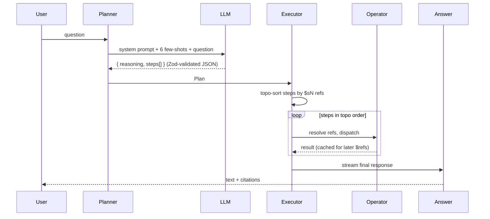

# KAG planning

This is what makes RepoBuddy not-just-RAG.

## The problem with plain RAG over code

A naïve "chat with your code" pipeline:

```
question → embed(question) → cosine-similar chunks → LLM(chunks + question) → answer
```

Works for **lexical** questions ("what does the README say about installation?"). Falls over on the questions a contributor actually has:

- _"Who calls processPayment, transitively, two hops deep?"_ — graph traversal, no embedding-similarity will find it.
- _"List all HTTP routes."_ — enumeration over an entity type, not similarity over text.
- _"I want to work on issue #191 — where do I start?"_ — needs to fetch the issue (not in any chunk), link it to mentioned code, walk the call graph from there, fetch source for the touched files.
- _"How was a similar issue fixed before?"_ — needs PR history + cross-issue embedding similarity, not chunk similarity.

## KAG = knowledge graph + planner

We index the repo into a typed knowledge graph (`entities` + `relations` + `chunks`, see [architecture](architecture.md#data-model--the-five-load-bearing-tables)) and expose **operators** that traverse it. An LLM planner chooses which operators to call, in what order, with what params, then a deterministic executor runs the plan and a final `answer` operator produces text grounded in the operator outputs.

The 20-operator catalogue is the API surface:

| Family | Operators |
| --- | --- |
| Lookup | `find_symbol`, `find_file`, `get_project_overview`, `list_concepts` |
| Graph traversal | `get_callers`, `get_callees`, `get_dependencies`, `get_dependents`, `find_implementations`, `walkthrough` |
| Search | `hybrid_search`, `vector_search_chunks`, `search_docs`, `find_by_concept` |
| Retrieve | `retrieve_code_chunks`, `get_summary`, `read_file` |
| Analysis | `tests_for` |
| External (GitHub) | `list_issues`, `list_prs`, `find_similar_issues`, `find_prs_for_issue`, `git_history` |
| Sink | `answer` |

The single source of truth for operator names is [`shared/schemas/plan.ts:OPERATOR_NAMES`](../shared/schemas/plan.ts) — a `const` tuple that drives a Zod enum that validates the LLM-emitted plan AND types the `OPERATORS` registry AND types the `TOOL_DEFS_MAP` in `agentic.ts`. Adding an operator is a compile-time obligation; the planner's prose catalogue (separate doc surface for the LLM) is the only place TypeScript can't enforce, and an integration test asserts it stays in sync.

## Two modes

### Planned mode (default)



- Single LLM call for planning (`temperature: 0.1`, `response_format: json_object`, post-validated with Zod).
- One retry-with-feedback if validation fails ("plan was rejected because: <issues>; please correct").
- Fallback to a deterministic `hybrid_search + answer` plan if retry also fails.
- Executor handles `$s1`, `$s2.field`, `$s1.issues[0].relatedEntities` style references via a small path resolver in `server/kag/executor.ts`.

### Agentic mode (Auto-explore checkbox)

```mermaid
sequenceDiagram
    User->>Loop: question
    Loop->>LLM: streamWithTools(messages, tool_defs, opts)
    loop until model emits no tool_call OR maxIter=12
      LLM-->>Loop: tool_call(name, args)
      Loop->>Operator: dispatch
      Operator-->>Loop: result (trimmed)
      Loop->>LLM: append role:'tool' message, continue stream
    end
    LLM-->>User: final text (no tool_call this turn)
```

- LLM gets KAG operators as OpenAI function-calling tools.
- Each tool result is trimmed (max 30 array items × 4 KB strings) before re-entering the prompt.
- 12-iteration cap with a graceful "tool budget exhausted, compose what you have" final pass.
- 4-8× more expensive per question than planned mode, so it's opt-in.

## Concrete example — "I want to work on issue #191"

### Planned mode

The few-shot in the system prompt teaches the model that issue resolution needs a multi-step expansion:

```json
{
  "reasoning": "Specific issue resolution — fetch it, then expand the top relatedEntities (walkthrough + callers) so the answer can ground in real code, not just point back to GitHub.",
  "steps": [
    { "id": "s1", "op": "list_issues", "params": { "issueNumber": 191 } },
    { "id": "s2", "op": "walkthrough", "params": { "entity": "$s1.issues[0].relatedEntities", "limit": 8 } },
    { "id": "s3", "op": "get_callers", "params": { "target": "$s1.issues[0].relatedEntities", "transitive": false, "limit": 12 } },
    { "id": "s4", "op": "retrieve_code_chunks", "params": { "entities": "$s3" } },
    {
      "id": "s5",
      "op": "answer",
      "params": {
        "question": "I want to work on issue #191 — where do I start in the code?",
        "context": ["$s1", "$s2", "$s3", "$s4"],
        "style": "detailed"
      }
    }
  ]
}
```

The executor:

1. Resolves `$s1` to nothing (first step) → calls `list_issues({issueNumber: 191})` → result envelope `{ issues: [{ number, title, body, relatedEntities: [...], ... }], relatedChunks: [...] }`.
2. Resolves `$s1.issues[0].relatedEntities` to an array of 8 entity objects → calls `walkthrough({entity: <array>, limit: 8})` → result `{ entities: [...callees + tests + parents...], mermaid: "<sequence diagram source>" }`.
3. Resolves the same ref for `get_callers` → returns inbound-edge entities.
4. Resolves `$s3` (the callers array) → fetches their code chunks via `entity_chunks`.
5. Final `answer` step gets `[$s1, $s2, $s3, $s4]` as context; `answerOp` inspects each, unwraps the issue envelope (lifts `relatedEntities` into the entity context, `relatedChunks` into the chunks list, pushes the `mermaid` block for the prompt to instruct verbatim inclusion), and streams the LLM reply with citation markers.

The Reasoning Inspector renders all five steps as a flowchart so the user can click any node and see params + result summary.

### Agentic mode (same question)

No pre-planning; the model decides each call from the previous result:

```
iter 1  → list_issues({issueNumber: 191})         → "issues[1] with 3 relatedEntities"
iter 2  → read_file({path: "tsconfig.json"})      → "1 file, 1 chunk"
         read_file({path: "src/index.ts"})        → "1 file, 2 chunks"          (parallel)
iter 3  → walkthrough({entity: <top related>})    → "5 entities, mermaid"
iter 4  → tests_for({entity: <walkthrough[0]>})   → "0 entities"  (no test coverage)
iter 5  → (no tool call) → final answer streams
```

Lower-latency for narrow lookups, but the loop can stall on poorly-typed questions. Planned mode is more predictable.

## Why this differs from "RAG with function calling"

Two things that aren't obvious from the description:

1. **The operators are typed and graph-aware.** `get_callers({transitive: true, maxDepth: 5})` is not "search for chunks that look like callers" — it's a recursive CTE over `relations WHERE type='calls'`. Embedding similarity will never find a function that doesn't lexically resemble its callees.

2. **The plan + trace are persisted and replayable.** Every assistant turn writes `plan` and `trace` JSONB to `chat_messages`. The Reasoning Inspector renders the SVG flowchart from those — so a user reopening a chat from a share link sees not just the answer, but the reasoning that produced it. This is the "transparent reasoning" axis competitors don't usually expose.

## Operator implementation pattern

Each operator is a typed function over `(params, ctx: OperatorContext)`. The shape:

```ts
export interface OperatorContext {
  workspaceId: string
  db: Database
  embeddings: EmbeddingsProvider
  llm: LLMProvider
  workspace?: { name; sourceUrl; languages; stats }
  pinnedEntities?: ...
  pinnedChunks?: ...
  responseLocale?: 'en' | 'ru'
  userPastedDiff?: boolean
  history?: ChatMessage[]
}
```

`answer` is the only operator that streams — everything else is `Promise<Result>`. The agentic loop only exposes non-streaming operators as tools; the final text generation is the LLM's own non-tool turn.

## Citation discipline

The `answer` operator's system prompt is strict about citation form:

- Code claims → `[chunk:UUID]` (resolves to source-viewer drawer)
- Entity claims → `[entity:UUID]` (resolves to neighbour graph drawer)
- GitHub issues → `[#42](issue-url)` — never `[entity:42]` or `[chunk:42]` (this was a real hallucination mode early on)

Post-stream the endpoint runs `extractCitations()` over the assembled text, validates `[chunk:UUID]` references against actual chunk rows, and emits an `invalid: string[]` list that the frontend renders with a warning badge. The model is held to its citations.

## Files to read next

- [`server/kag/planner.ts`](../server/kag/planner.ts) — system prompt + few-shots + retry-with-feedback
- [`server/kag/executor.ts`](../server/kag/executor.ts) — topo sort + reference resolver
- [`server/kag/agentic.ts`](../server/kag/agentic.ts) — tool-use loop + TOOL_DEFS_MAP
- [`server/kag/operators/index.ts`](../server/kag/operators/index.ts) — every operator
- [`shared/schemas/plan.ts`](../shared/schemas/plan.ts) — Zod enum (single source of truth for names)
- [`app/components/ReasoningInspector.vue`](../app/components/ReasoningInspector.vue) — flowchart + timeline rendering
